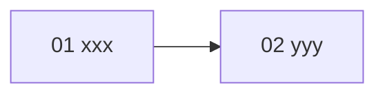

# {機能名} 実装プラン（チケット一覧）

{機能の一行説明}を PR 単位のチケットに分割した実装プランの入口。
**{機能名} の実装セッションは、必ずこのファイルと対象チケット 1 ファイルから読み始めること。**

## 設計ドキュメントとの関係

設計の一次情報は [docs/design/{機能名}/README.md](../../design/{機能名}/README.md)。本プランはそれを PR 単位に分割したもの。
各チケットには実装に必要な設計決定が再掲済みのため、原則として設計ドキュメントを読み直す必要はない（再掲の出典参照を深掘りしたい場合のみ「決定 N」を参照する）。
設計が改訂された場合は、ticket-split スキルの見直し・追加モードで影響チケットを更新する。

## チケット一覧

番号 = 推奨着手順。状態: `未着手` → `実装中` → `完了`（日付付き）。

| チケット | 概要 | 依存 | 状態 | PR |
| --- | --- | --- | --- | --- |
| [01-xxx.md](01-xxx.md) | {概要 1 行} | なし | 未着手 | - |
{チケット行を追加。ファイル未作成のチケットはリンクなしで「（ファイル未作成）」と状態に書く}

## 依存関係図

並行着手可能なグループ: {依存が独立しているチケットの組を明示。例: 01 と 03 は並行可}

## チケット横断の共通事項

### 共有物・競合点

複数チケットが触るファイルと着手順序の制約。

- `{共有ファイル}`: {触るチケットと順序の制約}

### 共通規約

- テストは AGENTS.md の規約に従う（`*.unit.test.ts` は `pnpm test:unit`、`*.integration.test.ts` は `pnpm test:integration`。SUT の隣にコロケート）
- マージ前に `pnpm lint` / `pnpm typecheck` / 該当テストを通す
- {マイグレーション運用・用語など、機能固有の横断事項があれば追記}

## ブランチ・PR 運用

実装モードは ticket-implement スキルが選択する（デフォルトは単一ブランチ統合モード）。共通: チケットの作業ブランチ名は `feature/{機能名}-NN-<チケット名>`、コミット / PR タイトルは `{機能名}: NN <チケット名>`、着手・マージは依存順。

- **単一ブランチ統合モード（デフォルト）**: 統合ブランチ `feature/{機能名}` に 1 チケット = 1 squash コミットで取り込み、機能全体で 1 PR。「実装中」= worktree 作成時、「完了」= 統合ブランチへのマージ。PR 列は統合 PR 作成時に全行へ同一 URL を一括記載する
- **チケット単位 PR モード（--pr）**: 1 チケット = 1 PR。「完了」= PR マージ。PR 作成済み・未マージは「実装中」＋PR リンクで表現する

## ステータス運用ルール

1. **実装セッションは、着手時・PR 作成時・マージ時に、本ファイルのチケット一覧表と対象チケット冒頭の状態行の両方を更新する**（「実装中」「完了」の意味と PR 列の記載タイミングは上の「ブランチ・PR 運用」の実装モードに従う）。
2. 実装時に計画との差分・後続チケットへの申し送りが生じたら、チケットの「実装メモ」に記入する。
3. **計画の変更（チケットの追加・削除・依存や順序の組み替え・設計改訂の反映）は ticket-split スキルで行う**。実装セッションで勝手にチケットを書き換えない。
