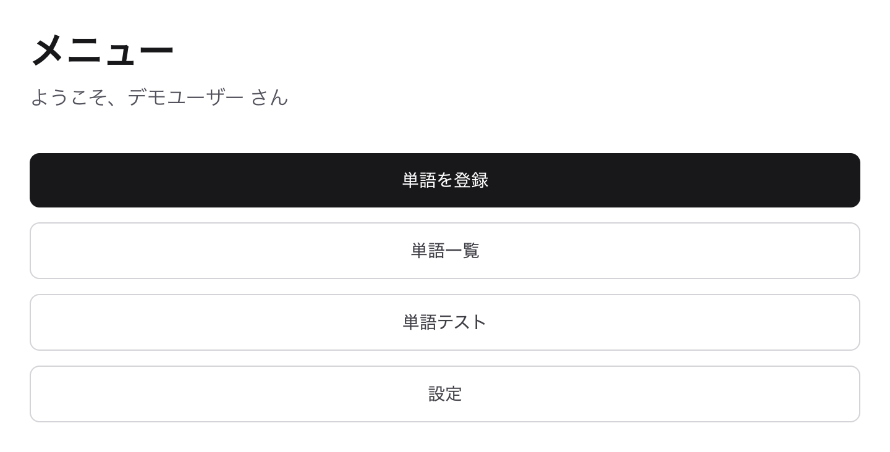

# 機能紹介

DejaWord は「一度忘れた単語との再会体験」をコンセプトにした英単語学習 Web アプリです。
学習の中で出会った単語を記録し、同じ単語に再び出会ったときに「以前も登録していた＝忘れていた」
という気づきを与えることで、記憶の定着を支援します。



登録した単語は掲載箇所（単語帳や教材など）ごとに整理し、単語テストで出題して
定着モード（間違えた単語を繰り返し出題するモード）まで一連の学習サイクルを回せます。

## 機能一覧

| 機能 | 説明 | ドキュメント |
| --- | --- | --- |
| 単語管理 | 単語の登録・一覧・詳細・編集。意味・訳語・例文・関連語・メモ・発音音源と、AI 下書きによる入力補助 | [word-management.md](./word-management.md) |
| 単語テスト | 掲載箇所と出題範囲を指定して 10 種類の出題形式でテスト | [word-quiz.md](./word-quiz.md) |
| 定着モード | テストで間違えた単語を、定着するまでラウンド形式で繰り返し出題 | [drill.md](./drill.md) |
| 設定 | 単語全般（自動音声など）・掲載箇所プリセット・単語テストのデフォルト設定 | 準備中 |
| 認証・アカウント | 新規登録・ログイン・アカウント情報の確認と編集 | [account.md](./account.md) |
| ユーザー管理（管理者向け） | ユーザーの招待・メール検証リンク発行など（system ユーザー専用） | 準備中 |

## スクリーンショットについて

本ドキュメントのスクリーンショットは、開発環境に登録したデータを
`scripts/e2e/capture-docs-screenshots.ts` で撮影したものです。

### 再生成レシピ

```sh
docker compose up -d   # ローカル DB（deja-word-db）
pnpm dev               # localhost:3000（別ポートの場合は BETTER_AUTH_URL も上書きする）
pnpm e2e:capture-docs  # docs/features/images/ に一括出力
```

- 前提: `pnpm db:seed`・`pnpm db:set-system-password` 済みのローカル DB と、
  システムにインストール済みの Google Chrome（playwright-core が `channel: "chrome"` で利用）。
- `--only <section>[,<section>]` でセクション単位の部分再撮影ができる
  （セクション名はスクリプト内 `SECTIONS` を参照）。
- 撮影内容はローカル DB の登録データに依存する。commit 前に画像を目視レビューし、
  公開して問題ない内容かを確認すること。
- 端末やフォントの差でピクセル単位の差分は出るため、完全一致は求めない
  （意味のある変更があったときのみ再生成・コミットする）。
