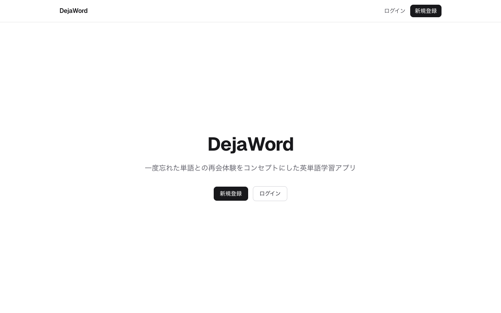
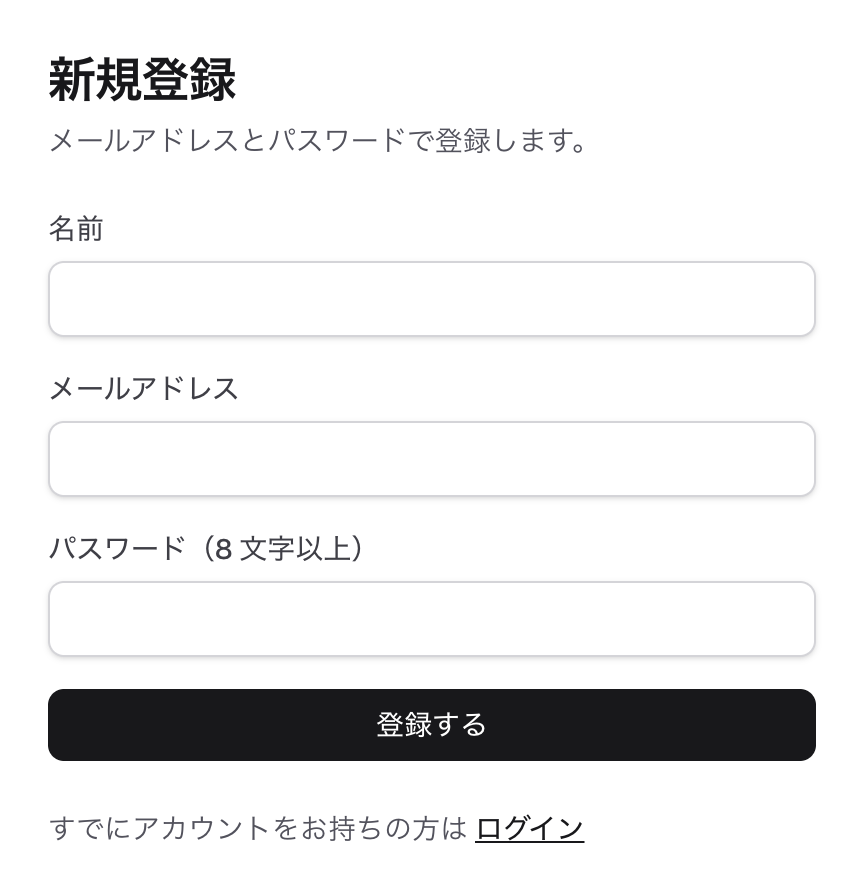
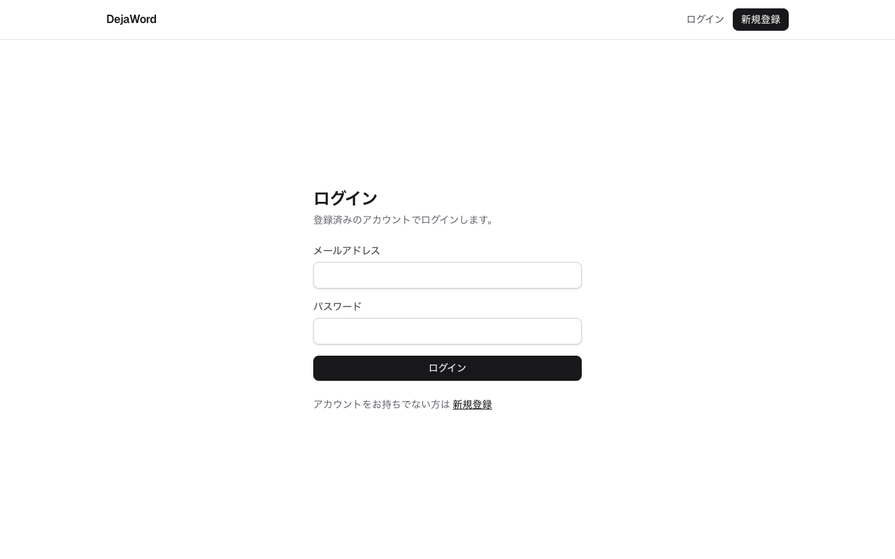
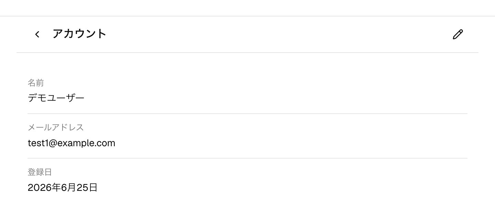

# 認証・アカウント

## 概要

メールアドレスとパスワードによる認証（Better Auth）でユーザーを管理します。
単語や学習履歴はユーザーごとに分離され、ログインするとメニューから各機能へアクセスできます。

## 主な画面と操作

### トップページ

未ログインでアクセスするとトップページが表示され、「新規登録」「ログイン」へ進めます。

### 新規登録

トップページまたはヘッダーの「新規登録」から、名前・メールアドレス・パスワード（8 文字以上）で
アカウントを作成します。登録が完了するとそのままログイン状態になります。

### ログイン

登録済みのメールアドレスとパスワードでログインします。未ログインで各機能の URL を開いた場合は
ログイン画面へ誘導され、ログイン後に元のページへ戻ります。

### アカウント情報の確認と編集

メニューのヘッダーにある自分の名前から、アカウント画面を開けます。名前・メールアドレス・登録日を
確認でき、編集アイコンから名前を変更できます。

## 補足

- 運用環境によっては新規登録の受付を停止していることがあります（トップページに「新規登録」が
  表示されません）。その場合は管理者からの招待によりアカウントが発行され、案内されたリンクから
  パスワードを設定するとログインできるようになります（→ 管理者向けの[ユーザー管理](./admin.md)）。
- パスワードやメールアドレス自体の変更をアカウント画面から行うことは現状できません。
