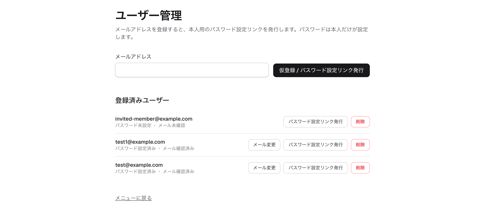

# ユーザー管理（管理者向け）

## 概要

本番環境では、セルフサインアップ（新規登録）を停止し、管理者がユーザーを招待する運用ができます。
管理者は system ユーザーとしてログインしているときだけ「ユーザー管理」画面（`/admin/users`）を開けます
（それ以外のユーザーには存在が見えません）。ここでメールアドレスを登録すると、本人がパスワードを設定する
ためのリンクを発行できます。

## 主な画面と操作

### ユーザー管理

メールアドレスを入力して「仮登録 / パスワード設定リンク発行」を押すと、そのアドレスのユーザーが仮登録され、
パスワード設定リンク（有効期限 24 時間）が発行されます。発行されたリンクを本人に渡し、本人が開いて自分で
パスワードを設定します（`/set-password`）。パスワードは管理者が設定せず、本人だけが知る形になります。
登録済みユーザーの一覧では、各ユーザーの「パスワード設定済み／未設定」「メール確認済み／未確認」を
確認でき、設定リンクの再発行・メールアドレスの変更・ユーザーの削除も行えます。

## 補足

- 管理者とは system ユーザー（`id="system"`）のことです。system ユーザーは、共通の掲載箇所
  （共有の単語帳など、全ユーザーに見える共有マスタ）の所有者でもあります。
- メール送信は行いません。パスワード設定リンクやメールアドレス変更の検証リンクは画面に表示されるので、
  管理者が本人に手渡します。本人がリンクを踏めた＝そのアドレスを受信できた証明になり、「メール確認済み」に
  なります。
- 招待・パスワード設定・メールアドレス変更・ユーザー削除の詳しい手順と注意点は、運用ドキュメント
  [管理者によるユーザー招待](../ops/admin-user-invite.md) を参照してください。
