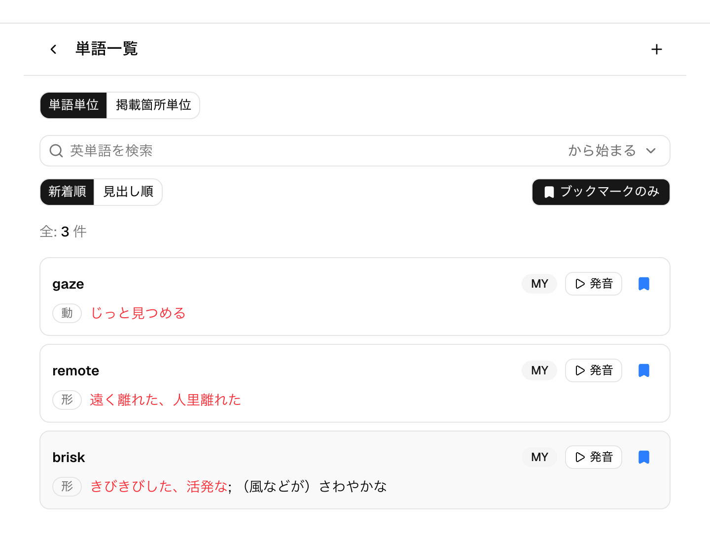
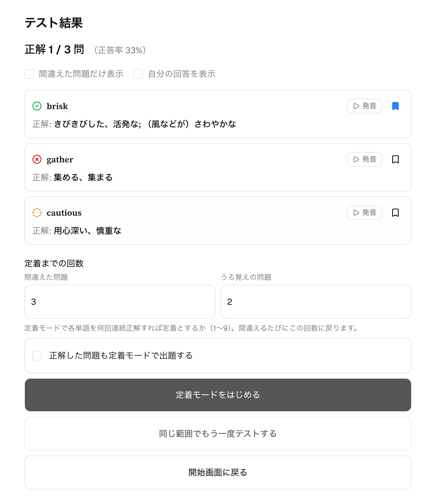
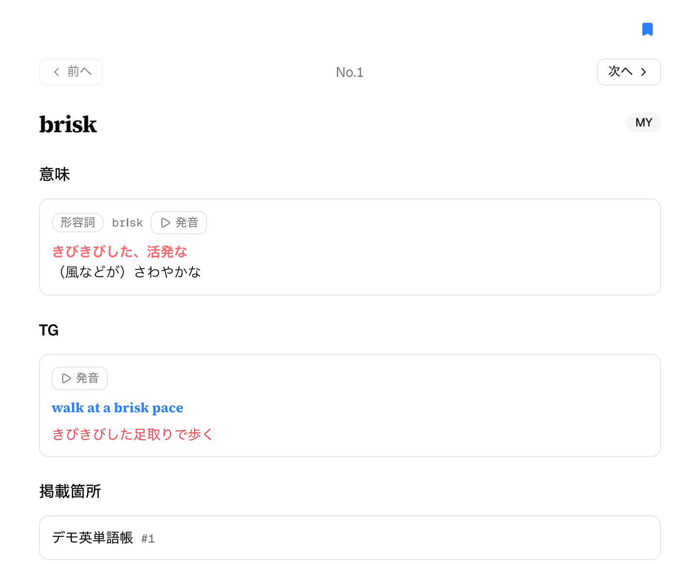
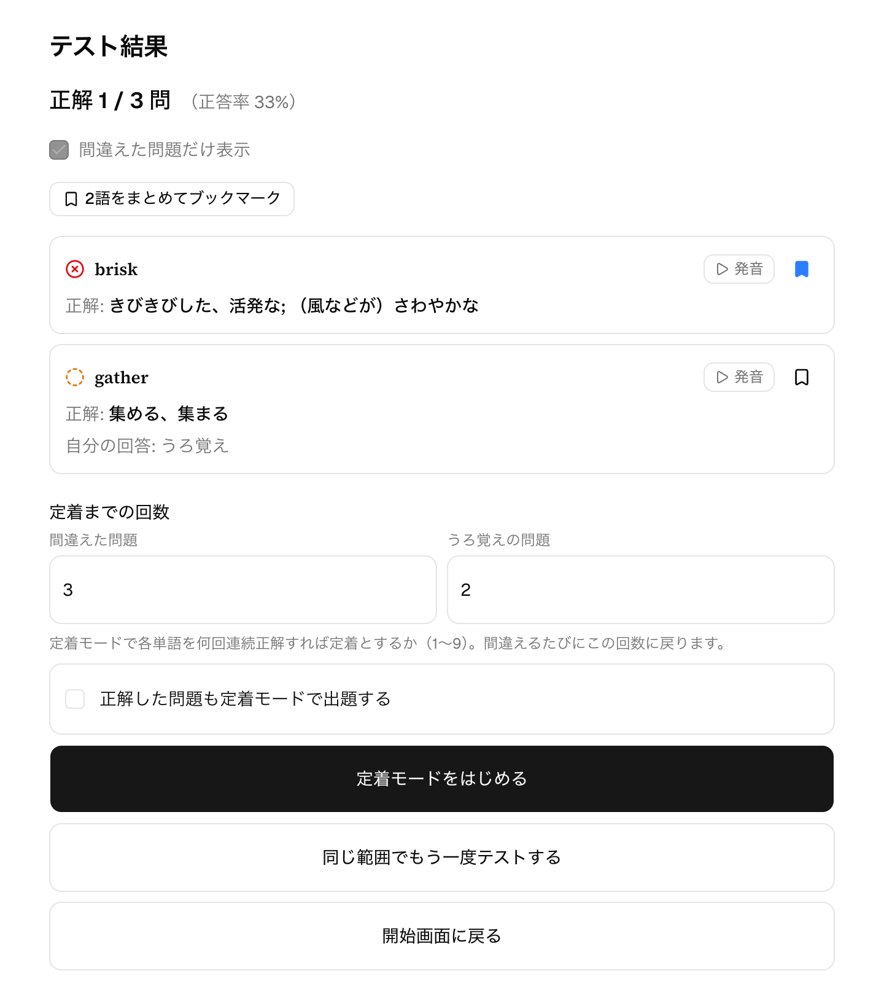
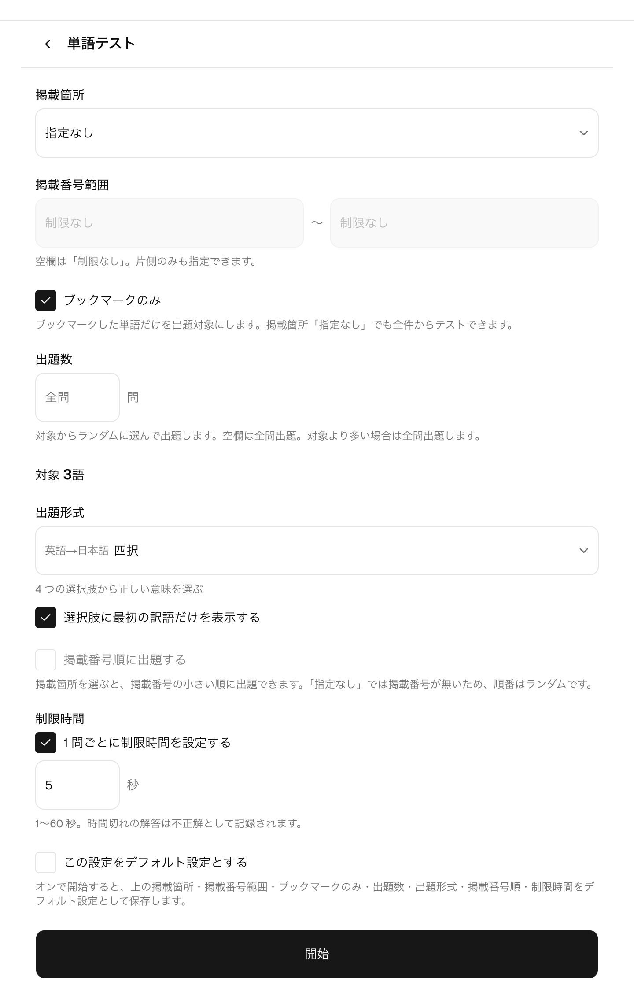

# ブックマーク

## 概要

ブックマークは、苦手な単語に印を付けて、あとから見返したり単語テストの出題対象を絞り込んだりする機能です。
1 単語につき ON/OFF のシンプルなマークで、単語一覧・単語詳細・テスト結果のどこからでもアイコンのタップだけで
付け外しできます。「テストで間違えた単語にその場で印を付け、後日ブックマークだけをまとめてテストし直す」という
苦手つぶしの回し方ができます。

## 主な画面と操作

### 付け外しと「ブックマークのみ」フィルタ

ブックマークの付け外しは、単語一覧の行・単語詳細画面・テスト結果一覧の行・テスト結果から開く単語詳細
ダイアログの 4 箇所にあるブックマークアイコンで行います。タップで即座に切り替わり、付いている単語は
青の塗りつぶしで表示されます。単語一覧では「ブックマークのみ」トグルでブックマーク済みの単語だけに
絞り込めます（単語ビュー・掲載箇所ビューのどちらでも使えます）。

### テスト結果からの付け外し

テスト結果の一覧では、各単語の行にブックマークアイコンが並びます。答え合わせで「間違えた・うろ覚えだった」と
わかった単語に、その場で印を付けるのに便利です。

行をタップして開く単語詳細ダイアログの右上でも付け外しでき、ダイアログでの変更は閉じたあとの行の表示にも
同期します。

「間違えた問題だけ表示」をオンにすると、表示中の単語をまとめて登録できる「◯語をまとめてブックマーク」
ボタンが現れます。押すと表示中の単語が一度にブックマークされ、すでに付いている単語はそのままです
（何度押しても二重には付きません）。まとめて外すことはできないので、外したいときは行のアイコンで
1 件ずつ切り替えます。

### 単語テストをブックマークで絞る

単語テストの開始画面の「ブックマークのみ」をオンにすると、出題対象がブックマーク済みの単語に絞られます。
掲載箇所・掲載番号範囲との組み合わせ（範囲内のブックマークだけ）と、掲載箇所「指定なし」でのブックマーク
全件テストの両方ができ、対象の語数はプレビューで確認できます。「この設定をデフォルト設定とする」の保存
対象にも含まれます（→ [設定](./settings.md)）。

## 補足

- 共通の単語（MY バッジのない共有の単語）にもブックマークを付けられます。ブックマークは自分だけの記録で、
  他のユーザーには見えません。
- 「ブックマークのみ」フィルタの表示中に行のブックマークを外しても、その行はすぐには消えません。誤って
  タップしたときにその場で付け直せるための挙動で、一覧を開き直すと反映されます。
- ブックマークで絞ったテストから[定着モード](./drill.md)に進むこともできます。進行中の定着モードの一覧では、
  出題条件に「ブックマークのみ」が表示され、通常のテスト由来のものと区別できます。
