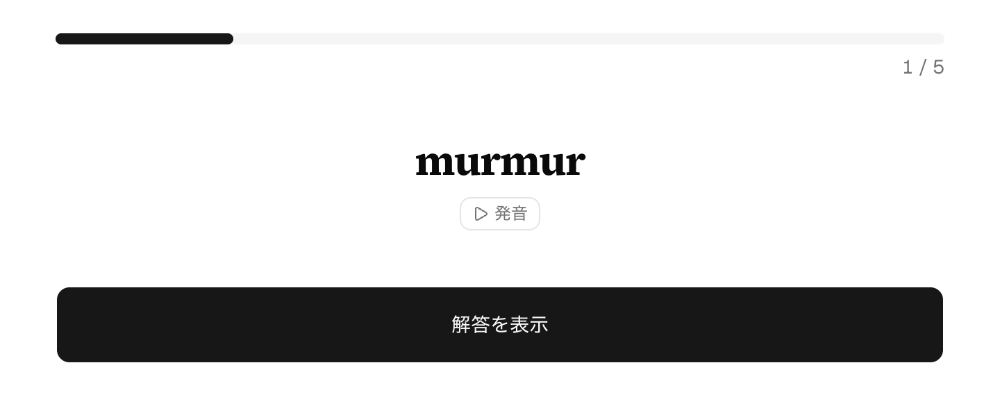
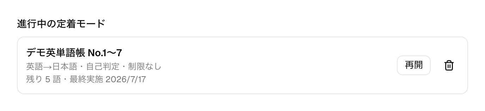
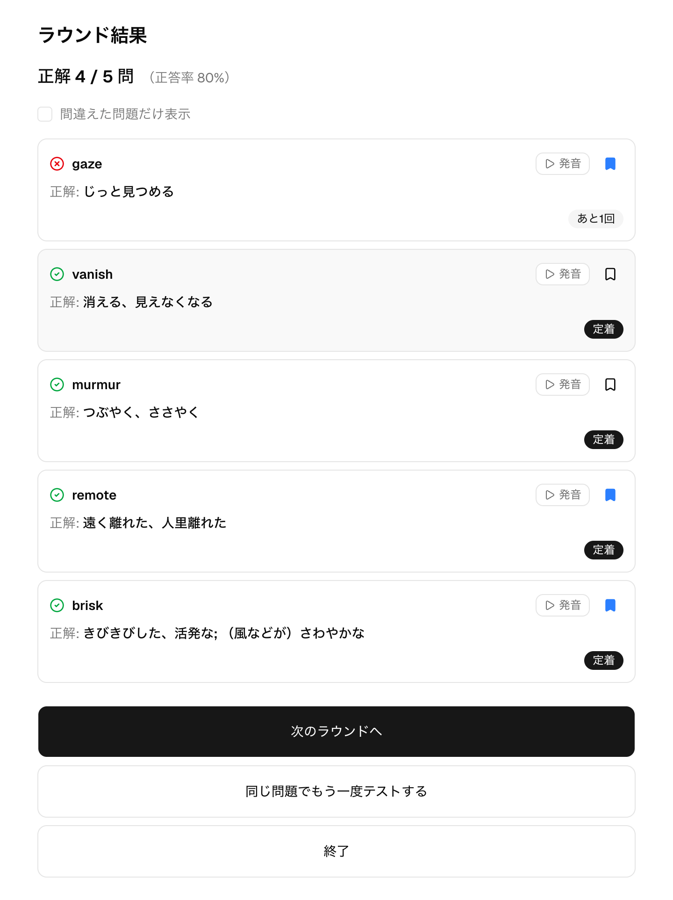

# 定着モード

## 概要

定着モードは、単語テストで間違えた単語・うろ覚えの単語を、覚え直せるまで繰り返し出題するモードです。
各単語には「定着までの残り回数」があり、連続で正解するたびに減っていきます。残りが 0 になった単語は「定着」となり、
出題から外れます。忘れかけた単語を確実に覚え直すための、テストとセットで使う仕上げの機能です。

## 定着モードをはじめる

定着モードは、単語テスト（→ [単語テスト](./word-quiz.md)）の結果画面から始めます。結果画面で「定着までの回数」
（間違えた問題・うろ覚えの問題を何回連続正解すれば定着とするか）を決め、「定着モードをはじめる」を押すと、その回を
もとにした定着待ちの単語がまとまります。「正解した問題も定着モードで出題する」をオンにすると、正解した単語も対象に
加えられます。出題形式・制限時間はもとのテストの設定を引き継ぎます。

## 主な画面と操作

### ラウンドの設問

1 ラウンドは、まだ定着していない単語をひと通り出題する単位です。出題のしかたはもとのテストと同じ形式で、
このラウンドでは自己判定の「解答を表示」で答え合わせをしています。ラウンドを終えるとその回の結果に応じて
各単語の残り回数が更新されます。

### 中断と再開

定着モードは途中でやめても進行状況が残り、単語テストの開始画面の「進行中の定着モード」に一覧されます。
各行には掲載箇所と掲載番号の範囲・出題形式・残りの語数・最終実施日が表示され、「再開」で続きから、
ゴミ箱アイコンで削除できます。削除しても、これまでの解答の記録自体は残ります。

### ラウンド結果

ラウンドを終えると、単語ごとに残り回数が「あと◯回」または「定着」のバッジで示されます。正解すると残りが
1 減り、間違い・うろ覚えのときは設定した回数に戻ります。単語テストの結果と同じく、自分の回答は既定では出さず
「自分の回答を表示」をオンにしたときだけ表示されます（オフでも残り回数のバッジは出ます）。
まだ定着していない単語があれば「次のラウンドへ」で
続けられ、残り回数を変えずにもう一度確かめたいときは「同じ問題でもう一度テストする」を使います。

## 補足

- すべての単語が定着すると定着モードは完了します。完了画面からは、もとのテストと同じ範囲で「同じ範囲でもう一度
  テストする」を選び、通常の単語テストとして定着を確かめられます。もとのテストで出題数を指定していた場合は、
  同じ出題数で範囲からあらためてランダムに選ばれます。
- 「あと◯回」の残り回数は連続正解で減るため、途中で間違えるとリセットされ、確実に覚えるまで出題が続きます。
- 出題のもとになる掲載箇所・掲載番号や出題形式については、単語テスト（→ [単語テスト](./word-quiz.md)）を
  参照してください。
