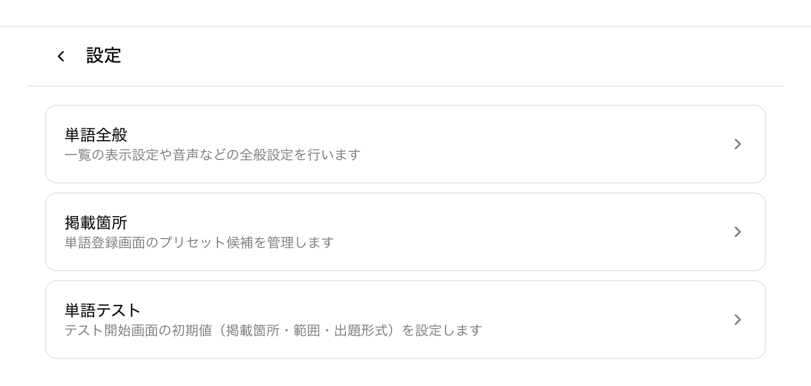
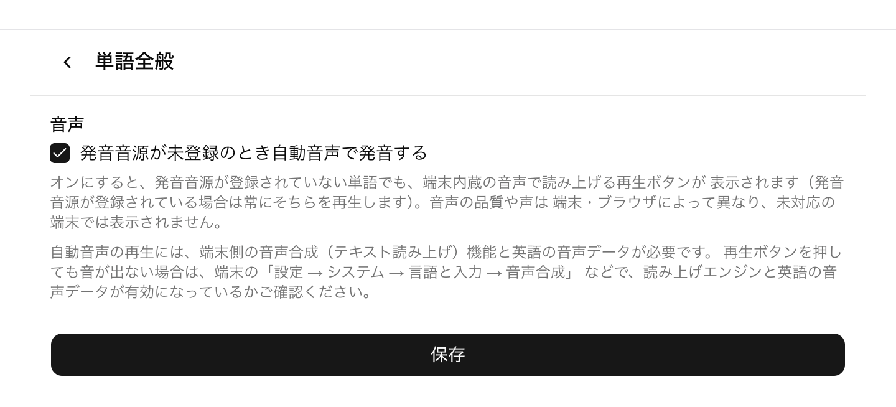
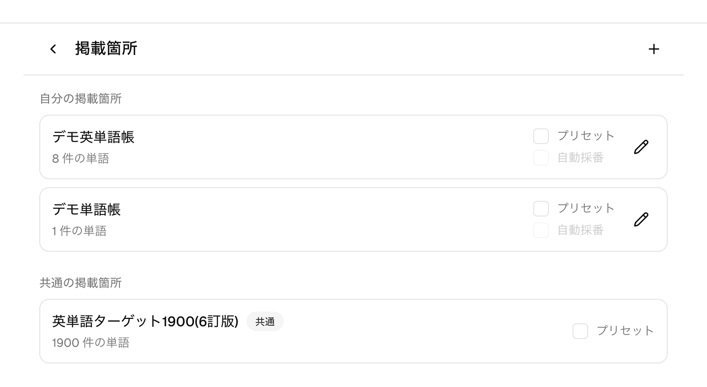
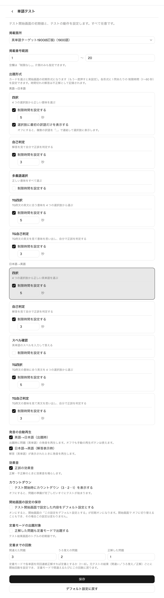

# 設定

## 概要

設定では、単語やテストの動作を自分好みに調整できます。設定は「単語全般」「掲載箇所」「単語テスト」の
3 つに分かれ、メニューの「設定」から開けます。すべて任意で、変更しなくても各機能は既定の動作で使えます。
設定はユーザーごとに保存されます（発音音源のダウンロードだけは端末ごとの保存です）。

## 主な画面と操作

### 設定のトップ

メニューの「設定」を開くと、「単語全般」「掲載箇所」「単語テスト」の 3 つの入口が並びます。目的の設定画面へ
進み、内容を変更したら「保存」で確定します。

### 単語全般（自動音声・発音音源のダウンロード）

単語全般では、発音音源が未登録の単語の読み上げ方法を設定します。「発音音源が未登録のとき自動音声で
発音する」をオンにすると、発音音源が登録されていない単語でも、端末内蔵の音声（テキスト読み上げ）で
再生ボタンが表示されます。発音音源が登録されている単語では常にそちらを再生します。自動音声の品質や声は
端末・ブラウザによって異なり、機能に未対応の端末では再生ボタンは表示されません。自動音声のボタンは
三角の再生アイコンで薄い表示になり、登録済みの発音音源のボタン（マイクのアイコン・はっきりした枠線）と
区別できます。

自動音声は、表示のための記号を読み飛ばして語だけを読み上げます。「ここに語が入る」ことを表すチルダ
（`so that ~` の `~`）、地域を表す注記（`【米】check` の `【米】`）、文字の装飾に使う記号
（→ [単語管理](./word-management.md)）は読まれません。

同じ画面の「発音音源のダウンロード」では、自分が使える発音音源（共通の単語帳のものを含む）を
まとめて端末に保存できます。保存しておくと、圏外や機内モードでも発音を再生でき、以後の再生では
通信しません。全部でおよそ 20〜60MB になるため、Wi-Fi 接続時のダウンロードをおすすめします。

- 「対象 ○ 件 ／ 端末に保存済み ○ 件」で、保存の進み具合が分かります。
- 保存済みの音源は再ダウンロードしません。途中で「中止」しても、次に押したときは残りだけを取得します。
- 削除された音源や差し替え前の古い音源は、ダウンロード時にまとめて片付けられます。
- 「端末から削除」で保存した音源を消して容量を戻せます。単語や音源そのものは消えず、次の再生時に
  再びダウンロードされます。
- この 2 つのボタンは押した時点ですぐ動きます（画面下の「保存」とは関係ありません）。

### 掲載箇所の管理とプリセット

掲載箇所では、自分の掲載箇所の追加・編集と、単語登録画面に既定表示する掲載箇所（プリセット）を管理します。
各掲載箇所の「プリセット」をオンにすると、単語登録フォームでその掲載箇所が最初から選ばれた状態になります。
プリセットにした掲載箇所では「自動採番」も設定でき、単語を追加するたびに掲載番号が自動で振られます。
共通の掲載箇所（管理者が用意した共有の単語帳など）も、自分のプリセットとして取り込めます。

### 単語テストのデフォルト設定

単語テストでは、テスト開始画面の初期値（掲載箇所・掲載番号範囲・出題数・出題形式）と、テスト中の動作をまとめて
設定します。出題形式ごとに 1 問あたりの制限時間（1〜60 秒）を個別に設定でき、時間切れの解答は不正解として
記録されます。発音の自動再生・正誤の効果音・開始時のカウントダウン、定着モードの出題対象や定着までの回数
（間違えた・うろ覚え・正解ごとの開始回数）も、ここで既定値を決められます。「デフォルト設定に戻す」で
推奨値に戻せます（内容を確認して「保存」で確定）。

## 補足

- 単語テストのデフォルトは開始画面の初期値です。開始画面ではその場だけ変更でき、「この設定をデフォルト
  設定とする」で保存すれば次回の初期値になります。
- 出題形式の内容や制限時間の扱いは[単語テスト](./word-quiz.md)を、掲載箇所・掲載番号・共通の掲載箇所の
  詳しい扱いは[単語管理](./word-management.md)を参照してください。
