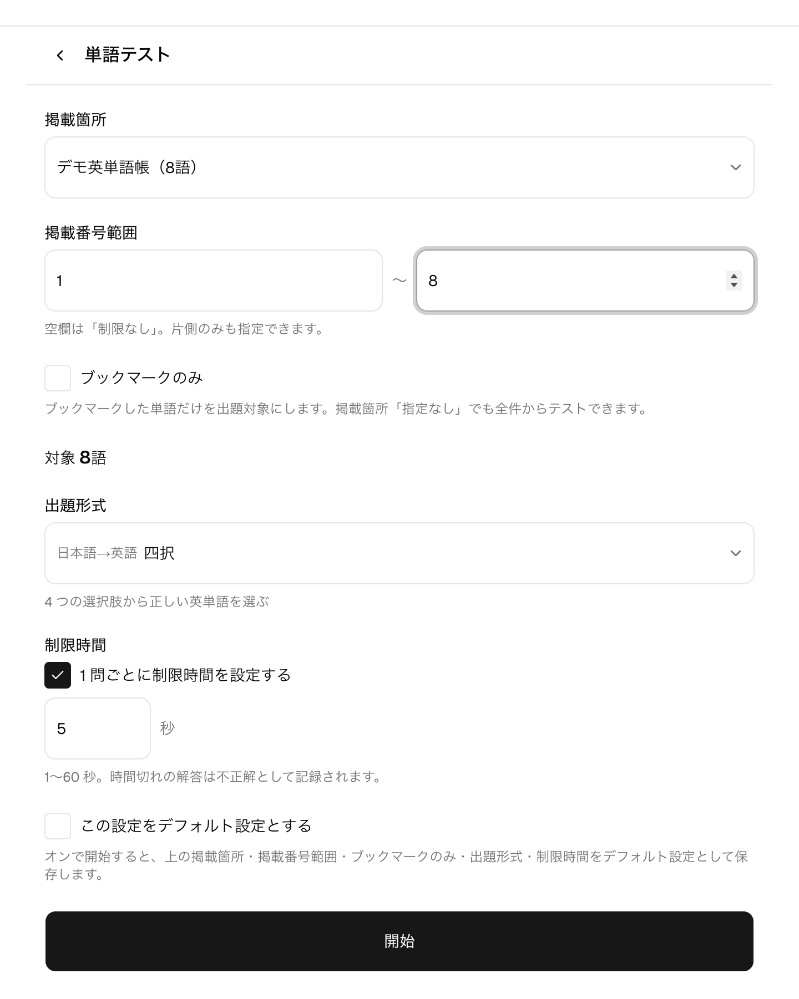
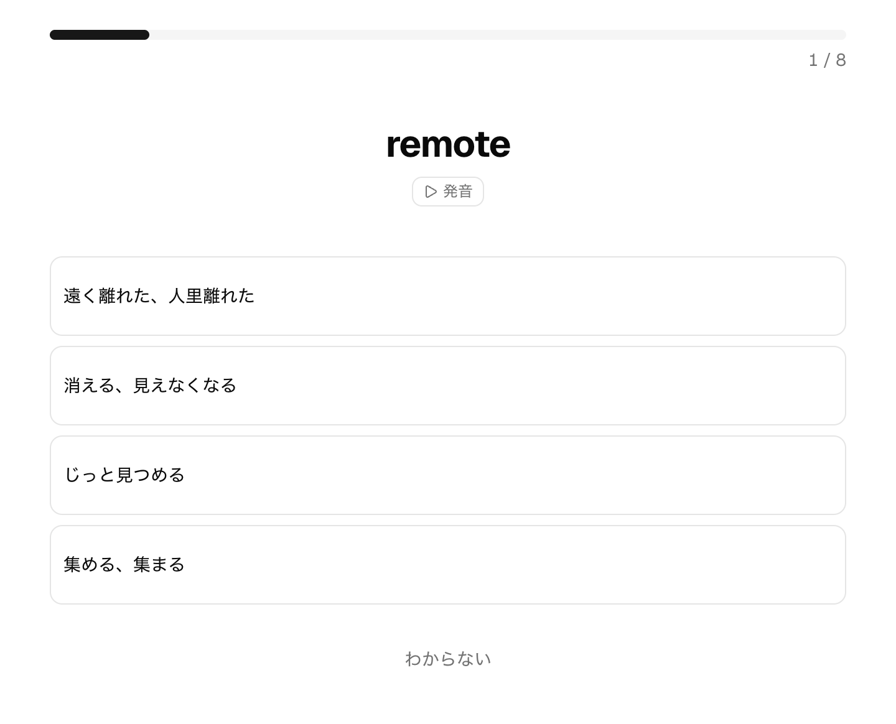
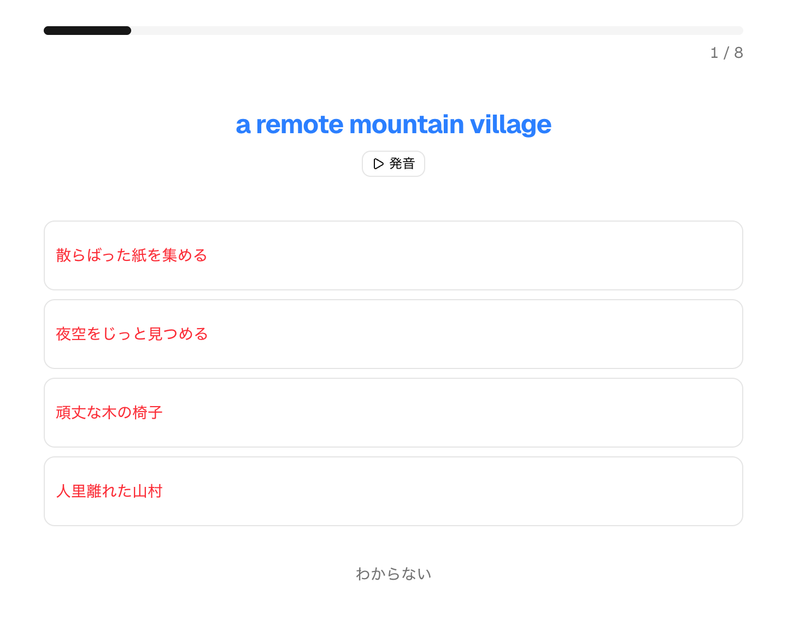
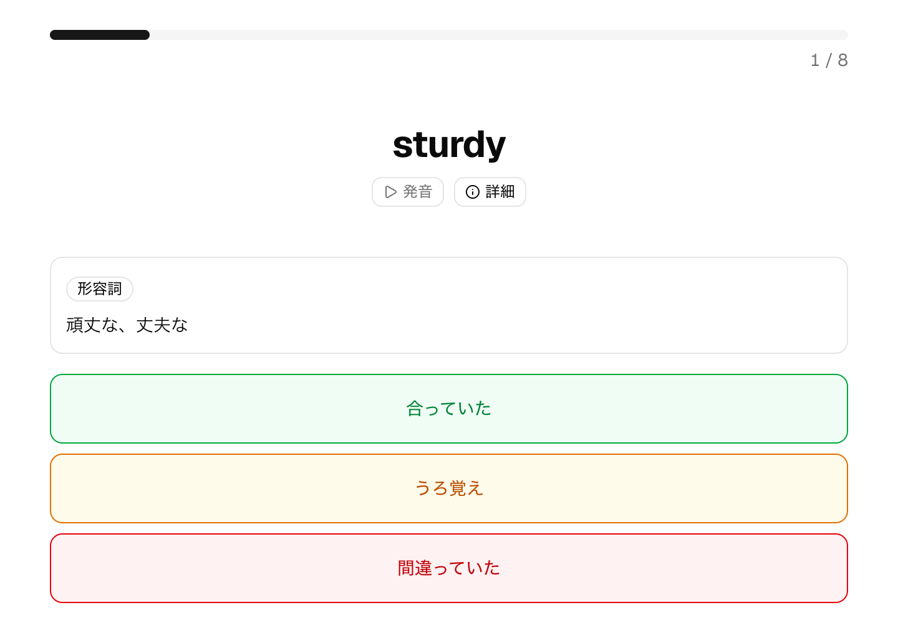
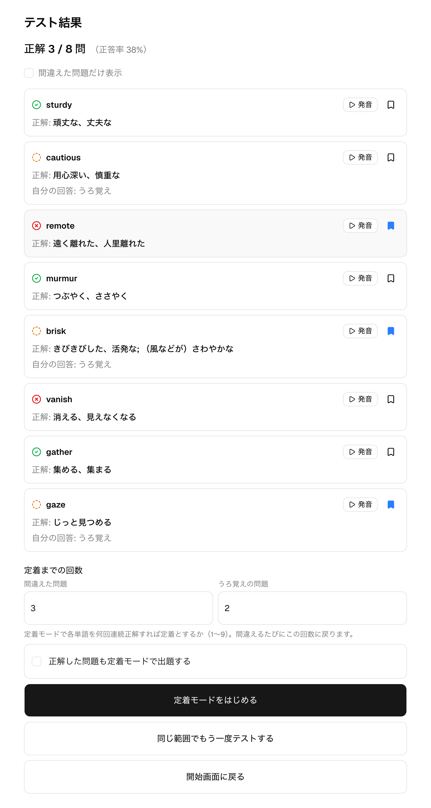

# 単語テスト

## 概要

単語テストは、登録した単語を掲載箇所と掲載番号で範囲を決めて出題し、覚えているかを確かめる機能です。
英語→日本語・日本語→英語の 10 種類の出題形式から選べ、1 問ごとの制限時間も設定できます。
一度覚えたはずの単語をここで問い直し、忘れかけた単語との再会につなげるのが DejaWord のねらいです。
テスト結果からは、間違えた単語を繰り返し覚え直す[定着モード](./drill.md)に進めます。

## 主な画面と操作

### テストを始める

掲載箇所を選び、掲載番号の範囲・出題数・出題形式・制限時間を決めて開始します。範囲の下には対象となる語数が
プレビュー表示され、掲載番号のない単語や意味未登録の単語などの対象外の内訳も確認できます。出題数を指定すると、
範囲の対象からランダムに選ばれたその問数だけが出題され、プレビューにも「うち◯問を出題」と併記されます
（空欄は全問出題。対象より多い指定も全問出題）。広い範囲から抜き打ちで数問だけ確かめたいときに便利です。
設定した掲載箇所・範囲・ブックマークのみ・出題数・出題形式・制限時間は「この設定をデフォルト設定とする」で
保存でき、次回の初期値になります。「ブックマークのみ」をオンにすると、出題対象をブックマークした単語だけに
絞れます（→ [ブックマーク](./bookmark.md)）。

### 四択

四択（英語→日本語）は、英単語を見て正しい訳語を 4 つの選択肢から選ぶ形式です。選ぶとその場で正誤が
確定し、正解は緑・選んだ誤答は赤で示されます。答えが思い浮かばないときは「わからない」を選べます。
発音音源が登録されていれば「発音」から聞けます。

### TG四択

TG四択（英語→日本語）は、TG 例文の英文を見て、それに合う意味を 4 つの選択肢から選ぶ形式です。TG 例文は
英文を青、意味を赤で色分けして表示します。TG 例文を登録している単語だけが対象になり、開始画面のプレビューで
「TG例文なしの単語」は対象外として除かれます。

TG 形式（TG四択・TG自己判定）の「発音」が鳴らすのは、単語ではなく **TG 例文の英文**です。例文に発音音源が
登録されていればその音源を、未登録なら端末内蔵の自動音声で英文を読み上げます。どちらも使えないときは
「発音」ボタン自体が現れません（単語の発音音源に切り替わることはありません）。自動再生をオンにしている
場合も同じ音が鳴ります。

### 自己判定

自己判定は、「解答を表示」で答えを見てから、自分で「合っていた」「うろ覚え」「間違っていた」を選ぶ形式です。
選択や入力による採点がないぶん手軽で、頭の中で思い出せたかどうかを自分の感覚で記録できます。うろ覚えは
正解と間違いの中間として扱われ、あとで定着モードの対象になります。

### テスト結果

テストを終えると、正解・うろ覚え・不正解が単語ごとに一覧表示され、正答率もわかります。「間違えた問題だけ表示」で
復習したい単語に絞れ、各単語をタップすると詳細を確認できます。ここから「定着までの回数」を決めて、間違えた単語・
うろ覚えの単語を覚え直す定着モードを始められます。

## 出題形式

出題形式は出題の向き（英語→日本語／日本語→英語）で分かれ、全部で 10 形式あります。代表として四択・TG四択・
自己判定（いずれも英語→日本語）を上に掲載しています。

| 向き | 形式 | 内容 |
| --- | --- | --- |
| 英語→日本語 | 四択 | 4 つの選択肢から正しい意味を選ぶ |
| 英語→日本語 | 自己判定 | 解答を見て自分で正誤を判定する |
| 英語→日本語 | 多義語選択 | 正しい意味をすべて選ぶ |
| 英語→日本語 | TG四択 | TG 例文の英文に合う意味を 4 つの選択肢から選ぶ |
| 英語→日本語 | TG自己判定 | TG 例文の英文を見て意味を思い出し、自分で正誤を判定する |
| 日本語→英語 | 四択 | 4 つの選択肢から正しい英単語を選ぶ |
| 日本語→英語 | 自己判定 | 解答を見て自分で正誤を判定する |
| 日本語→英語 | スペル確認 | 英単語のスペルを入力して答える |
| 日本語→英語 | TG四択 | TG 例文の意味に合う英文を 4 つの選択肢から選ぶ |
| 日本語→英語 | TG自己判定 | TG 例文の意味を見て英文を思い出し、自分で正誤を判定する |

## 補足

- 解答は、正解・うろ覚え・不正解のほか、答えが思い浮かばないときの「わからない」、制限時間つきで時間切れに
  なった「時間切れ」に分かれます。四択などで正解したときは「うろ覚えだった」を選んで、うろ覚えとして
  記録することもできます。
- 制限時間は 1 問ごとに任意で設定でき、時間切れの解答は不正解として記録されます。開始直後にはカウントダウンの
  演出を挟めます（→ [設定](./settings.md)）。
- 掲載箇所・掲載番号については単語管理（→ [単語管理](./word-management.md)）を、出題形式ごとの制限時間などの
  デフォルト設定については[設定](./settings.md)を参照してください。
