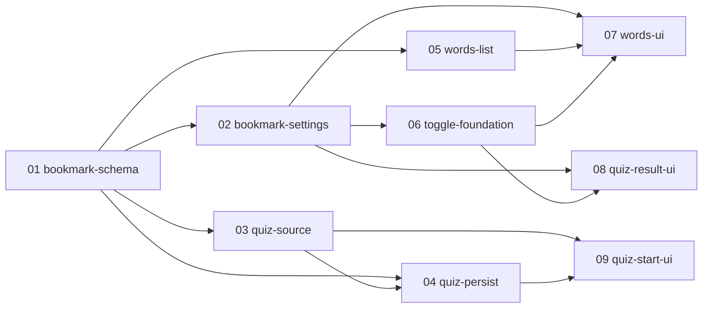

# bookmark 実装プラン（チケット一覧）

苦手な単語にブックマークを付け、単語テスト（quiz）の出題対象をブックマークで絞り込める機能を PR 単位のチケットに分割した実装プランの入口。
**bookmark の実装セッションは、必ずこのファイルと対象チケット 1 ファイルから読み始めること。**

## 設計ドキュメントとの関係

設計の一次情報は [docs/design/bookmark/README.md](../../design/bookmark/README.md)。本プランはそれを PR 単位に分割したもの。
各チケットには実装に必要な設計決定が再掲済みのため、原則として設計ドキュメントを読み直す必要はない（再掲の出典参照を深掘りしたい場合のみ「決定 N」を参照する）。
設計が改訂された場合は、ticket-split スキルの見直し・追加モードで影響チケットを更新する。

## チケット一覧

番号 = 推奨着手順。状態: `未着手` → `実装中` → `完了`（日付付き）。

| チケット | 概要 | 依存 | 状態 | PR |
| --- | --- | --- | --- | --- |
| [01-bookmark-schema.md](01-bookmark-schema.md) | Bookmark モデル新設（migration）＋ naming-book 登録＋ ADR「per-user side table＋開始時評価」起票 | なし | 完了（2026-07-16） | - |
| [02-bookmark-settings.md](02-bookmark-settings.md) | UseCase `setBookmarkForUser` / `getBookmarkedWordIdsForUser` ＋入力スキーマ `schema/bookmark.ts` | 01 | 完了（2026-07-16） | - |
| [03-quiz-source.md](03-quiz-source.md) | quiz-source 3 関数へのブックマーク述語・全件モード対応（後方互換のシグネチャ拡張）＋ ADR「全件モード」起票 | 01 | 完了（2026-07-16） | - |
| [04-quiz-persist.md](04-quiz-persist.md) | Drill / QuizDefaultSetting の migration ＋ schema/quiz 拡張＋ quiz-generate / drill-create / quiz-default-settings / drill 系 3 ファイルの対応 | 01, 03 | 実装中 | - |
| [05-words-list.md](05-words-list.md) | words-list に bookmarked 列＋「ブックマークのみ」フィルタ（バックエンドのみ） | 01 | 完了（2026-07-16） | - |
| [06-toggle-foundation.md](06-toggle-foundation.md) | server action `toggleBookmark` / `getBookmarkStates` ＋共有部品 BookmarkButton / RowBookmarkButton（UI 未設置） | 02 | 完了（2026-07-16） | - |
| [07-words-ui.md](07-words-ui.md) | 単語一覧の行・toolbar フィルタトグル・単語詳細への設置＋ E2E | 02, 05, 06 | 実装中 | - |
| [08-quiz-result-ui.md](08-quiz-result-ui.md) | quiz 結果一覧・単語詳細ダイアログへの設置（getWordDetailForDialog 拡張）＋ E2E | 02, 06 | 実装中 | - |
| [09-quiz-start-ui.md](09-quiz-start-ui.md) | quiz 開始フォーム「指定なし」＋「ブックマークのみ」・プレビュー連動・設定画面・drill ラベル＋ E2E | 03, 04 | 未着手 | - |

## 依存関係図

並行着手可能なグループ:

- 01 のマージ後、02・03・05 は並行可
- 04（03 の後）と 06（02 の後）は互いに並行可
- 07・08 は 06 の後に並行可（07 は 05 のマージも必要）
- 09 は 04 の後（07・08 とは並行可）

## チケット横断の共通事項

### 共有物・競合点

原則として同一ファイルは 1 チケットだけが触る分割にしてある。例外は以下の 3 ファイルで、いずれも依存関係または着手順序で直列化する。

- `prisma/schema.prisma` / migration: **01（Bookmark 新設）と 04（Drill nullable 化・sourceBookmarkedOnly・QuizDefaultSetting.bookmarkedOnly）の 2 チケットが migration を持つ**。04 は 01 に依存するため migration は必ず直列になる。他のチケットでスキーマ変更を追加しない（必要が生じたら ticket-split の見直し・追加モードへ）
  - Drill の nullable 化を 01 に同居させないのは、nullable 化が `drill-list.ts` 等の型を壊すため（コード対応と同一 PR でないと typecheck が通らない）
- `src/app/quiz/_components/start-form.tsx`: **03 が 1 行だけ触り**（除外内訳 `noNumber` の null 許容化に伴う型ガード）、本対応は 09。09 は 03 に依存するため直列になる
- `src/lib/quiz-preview.ts`: **03 が型のみ触り**（`QuizPreview.excluded.noNumber` の null 許容化）、本対応（入力の optional 化・bookmarkedOnly 受け渡し・assertOccurrenceVisible の条件化）は 04。04 は 03 に依存するため直列になる
- `src/lib/schema/quiz.ts`: 触るのは 04 のみ。extend 先（getQuizPreviewInputSchema / startQuizInputSchema）へは自動波及するため、09 はスキーマを変更せずフォーム側の対応のみ行う
- `src/app/quiz/actions.ts`: 触るのは 08 のみ（getQuizPreview は quiz-preview.ts へ委譲しているだけのため、プレビュー対応で変更しない。実装時に変更が必要と判明したら ticket-split の見直しへ）

### 共通規約

- テストは AGENTS.md の規約に従う（`*.unit.test.ts` は `pnpm test:unit`、`*.integration.test.ts` は `pnpm test:integration`。SUT の隣にコロケート）
- マージ前に `pnpm lint` / `pnpm typecheck` / 該当テストを通す
- 用語は naming-book に従い「ブックマーク（Bookmark）」で統一。「お気に入り」「スター」「マーク」は使わない。quiz 絞り込みの UI 文言は「ブックマークのみ」
- migration を含むのは 01 と 04 のみ。これらのマージ後に他 worktree へ切り替えたら `pnpm db:migrate` を実行する（AGENTS.md の worktree 運用）

## ブランチ・PR 運用

- ブランチ名: `feature/bookmark-NN-<チケット名>`
- PR タイトル: `bookmark: NN <チケット名>`
- マージは依存順（依存先チケットの PR がマージされてから着手・マージする）
- 運用メモ: 単一ブランチ統合モードで実装中（統合ブランチ `feature/bookmark`。チケット完了 = 統合ブランチへマージ、PR は全チケット完了後に一括作成）

## ステータス運用ルール

1. **実装セッションは、着手時・PR 作成時・マージ時に、本ファイルのチケット一覧表と対象チケット冒頭の状態行の両方を更新する**（PR 作成済み・未マージは「実装中」＋PR リンクで表現する）。
2. 実装時に計画との差分・後続チケットへの申し送りが生じたら、チケットの「実装メモ」に記入する。
3. **計画の変更（チケットの追加・削除・依存や順序の組み替え・設計改訂の反映）は ticket-split スキルで行う**。実装セッションで勝手にチケットを書き換えない。
