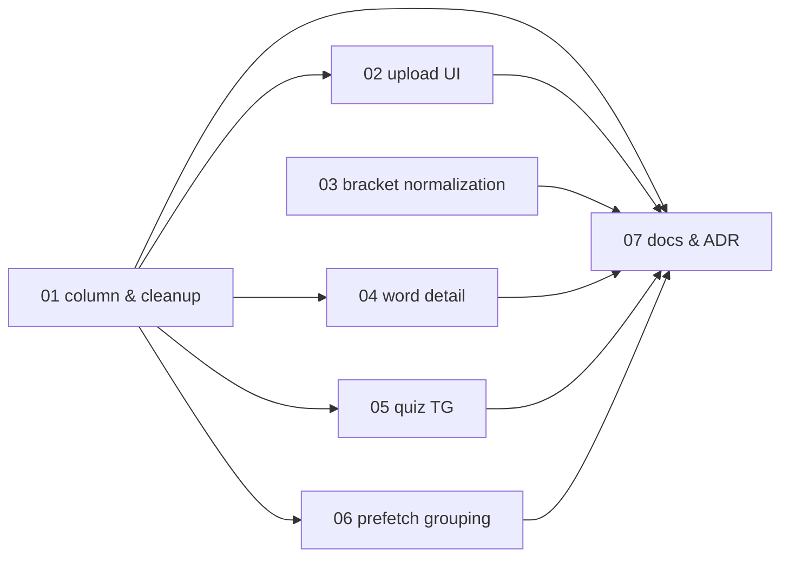

# 例文読み上げ（example-audio） 実装プラン（チケット一覧）

単語の例文の英文を読み上げ可能にする（発音音源の登録＋未登録時の TTS フォールバック）機能を PR 単位のチケットに分割した実装プランの入口。
**example-audio の実装セッションは、必ずこのファイルと対象チケット 1 ファイルから読み始めること。**

対応 issue: [#170](https://github.com/ganzinn/deja-word/issues/170)

## 設計ドキュメントとの関係

設計の一次情報は [docs/design/example-audio/README.md](../../design/example-audio/README.md)。本プランはそれを PR 単位に分割したもの。
各チケットには実装に必要な設計決定が再掲済みのため、原則として設計ドキュメントを読み直す必要はない（再掲の出典参照を深掘りしたい場合のみ「決定 N」を参照する）。
設計が改訂された場合は、ticket-split スキルの見直し・追加モードで影響チケットを更新する。

## チケット一覧

番号 = 推奨着手順。状態: `未着手` → `実装中` → `完了`（日付付き）。

| チケット | 概要 | 依存 | 状態 | PR |
| --- | --- | --- | --- | --- |
| [01-example-audio-column.md](01-example-audio-column.md) | `Example.pronunciationAudioUrl` 追加、`exampleTarget` ＋サービス API 2 本、削除・orphan 5 経路への Example 追加 | なし | 完了（2026-08-04） | - |
| [02-example-audio-upload-ui.md](02-example-audio-upload-ui.md) | 例文カードへの音源登録 UI と Server Action 2 本、フォーム値への pass-through | 01 | 実装中 | - |
| [03-speech-bracket-normalization.md](03-speech-bracket-normalization.md) | 読み上げの括弧正規化（`(…)` は中身を読む／`[…]` は落とす）と `TG_TEXT_PATTERN` の全角括弧追加 | なし | 完了（2026-08-04） | - |
| [04-word-detail-example-playback.md](04-word-detail-example-playback.md) | 単語詳細の例文カード上部にメタ行を新設し発音ボタンを 1 つ置く | 01 | 実装中 | - |
| [05-quiz-tg-example-audio.md](05-quiz-tg-example-audio.md) | TG 4 形式の発音ボタン・自動再生・プリロードの対象を TG例文へ差し替え（`QuestionBase.ttsText`） | 01 | 未着手 | - |
| [06-audio-prefetch-grouping.md](06-audio-prefetch-grouping.md) | manifest をグループ別（`word` / `example`）にし、設定画面を 2 行構成へ。prune は和集合 | 01 | 未着手 | - |
| [07-docs-and-adr.md](07-docs-and-adr.md) | naming-book・`docs/features/` 4 ページ更新、スクリーンショット再撮影、ADR 0079〜起票、設計ドキュメントの削除 | 01, 02, 03, 04, 05, 06 | 未着手 | - |

### 01 と 02 の分割について（設計の着手順序ヒントとの差分）

設計ハブの「着手順序のヒント 1」は、カラム追加・`pronunciation-audio.ts`・action・フォーム UI・削除/orphan 5 経路を**同一チケット**にまとめるとしている（[設計ハブ](../../design/example-audio/README.md) 実装への引き継ぎ、[02-data-model.md](../../design/example-audio/02-data-model.md) 決定 3）。本プランはこれを 01（カラム＋サービス層＋削除・orphan 5 経路）と 02（Server Action ＋フォーム UI）に分けている。

- **分けた理由**: 1 PR がテスト込みで 700 行超になり、レビュー 1 回で読み切れるサイズを外れるため
- **設計の意図は保たれる**: 設計が同一チケットを求めた根拠は「音源が登録できるのに消えない期間が生まれる」ことの回避。01 → 02 の依存順により、**登録手段（02）が入る前にクリーンアップ経路（01）が揃う**ため、孤児 blob が発生する期間は生じない
- 01 が追加する公開 API 2 本は 02 がマージされるまで未参照だが、未参照モジュールの先行追加はアプリを壊さない

## 依存関係図

並行着手可能なグループ:

- 着手時点: **01 と 03**（03 は `speech.ts` / `tg-example-text.tsx` のみで、カラムに依存しない）
- 01 マージ後: **02 / 04 / 05 / 06** の 4 本すべて（触るファイルが重ならない）
- ただし 05 の TG例文 TTS 読み上げ品質は 03 の括弧規則に依存するため、**05 は 03 のマージ後に着手するのが望ましい**（依存宣言はしない。03 が未マージでも 05 は単独でマージ可能）

## チケット横断の共通事項

### 共有物・競合点

複数チケットが触るファイルと着手順序の制約。**本分割では、同一ファイルを 2 チケットが触る箇所はない**（各ファイルの担当は下表で一意）。

| ファイル | 担当チケット |
| --- | --- |
| `prisma/schema.prisma` ＋ マイグレーション | 01 のみ |
| `src/lib/pronunciation-audio.ts` | 01 のみ |
| `src/lib/{words-delete,words-update,admin-user-delete,occurrence-purge,blob-purge}.ts` | 01 のみ |
| `src/app/words/[id]/edit/actions.ts` / `src/lib/schema/word-form.ts` / `src/app/words/new/_components/examples-fields.tsx` | 02 のみ |
| `src/lib/speech.ts` / `src/components/tg-example-text.tsx` | 03 のみ |
| `src/components/word-detail-view.tsx` | 04 のみ |
| `src/lib/quiz/**` ＋ `src/app/quiz/**`（`_components/` と `actions.unit.test.ts`） | 05 のみ |
| `src/lib/audio-manifest.ts` / `src/lib/audio-cache.ts` / `src/app/api/audio/manifest/route.ts` / `src/app/settings/general/page.tsx` / `src/app/settings/general/_components/audio-prefetch-section.tsx` / `scripts/e2e/verify-audio-prefetch.ts` | 06 のみ |
| `docs/reference/naming-book.md` / `docs/features/**` / `docs/adr/**` / `scripts/e2e/db.ts` | 07 のみ |

**変更しないと明示されているファイル**（実装時に不要な変更を入れないこと）:

- `src/lib/words-detail.ts` — examples は `include` 取得のため、カラム追加で自動的に `WordDetail["examples"][number]` に載る（[06-architecture.md](../../design/example-audio/06-architecture.md) 決定 2）
- `src/lib/audio-import.ts`（`db:import-audio`） — `Meaning` 専用のまま（[02-data-model.md](../../design/example-audio/02-data-model.md) 決定 6）
- `src/components/audio-play-button.tsx` / `src/components/pronunciation-audio-manager.tsx` — 無改造で再利用（[06-architecture.md](../../design/example-audio/06-architecture.md) 決定 4）
- `scripts/e2e/verify-audio-cache.ts`（`pnpm e2e:audio-cache`） — 音源の種類に依存しない（[06-architecture.md](../../design/example-audio/06-architecture.md) 決定 5）

### 共通規約

- テストは AGENTS.md の規約に従う（`*.unit.test.ts` は `pnpm test:unit`、`*.integration.test.ts` は `pnpm test:integration`。SUT の隣にコロケート）
- マージ前に `pnpm lint` / `pnpm typecheck` / 該当テストを通す
- **新規モジュールは作らない**。本機能で新規に作るファイルはマイグレーションのみで、ロジックはすべて既存モジュールへの追加に収める（[06-architecture.md](../../design/example-audio/06-architecture.md) 決定 4）
- **マイグレーション運用**: 01 のマイグレーション適用後は、他チケットの worktree でも `pnpm db:migrate` を実行してから作業する（AGENTS.md「Worktree」の DB 共有）
- **ドキュメント更新の集約**: 本機能では `docs/features/` の更新を最終チケット 07 に集約する（撮影が全機能の実装完了を要するため）。AGENTS.md の「同じ PR で `docs/features/` を更新する」に対する本機能限りの例外で、07 の完了をもって規約を満たす

## ブランチ・PR 運用

- ブランチ名: `feat/example-audio-NN-<チケット名>`（worktree を切る場合は `scripts/wt-new.sh example-audio-NN-<チケット名>`）
- PR タイトル: `example-audio: NN <チケット名>`
- マージは依存順（依存先チケットの PR がマージされてから着手・マージする）
- 運用メモ: 単一ブランチ統合モードで実装中（統合ブランチ `feature/example-audio`、機能全体で 1 PR。ブランチ名は `feature/example-audio-NN-<チケット名>`）

## ステータス運用ルール

1. **実装セッションは、着手時・PR 作成時・マージ時に、本ファイルのチケット一覧表と対象チケット冒頭の状態行の両方を更新する**（PR 作成済み・未マージは「実装中」＋PR リンクで表現する）。
2. 実装時に計画との差分・後続チケットへの申し送りが生じたら、チケットの「実装メモ」に記入する。
3. **計画の変更（チケットの追加・削除・依存や順序の組み替え・設計改訂の反映）は ticket-split スキルで行う**。実装セッションで勝手にチケットを書き換えない。
