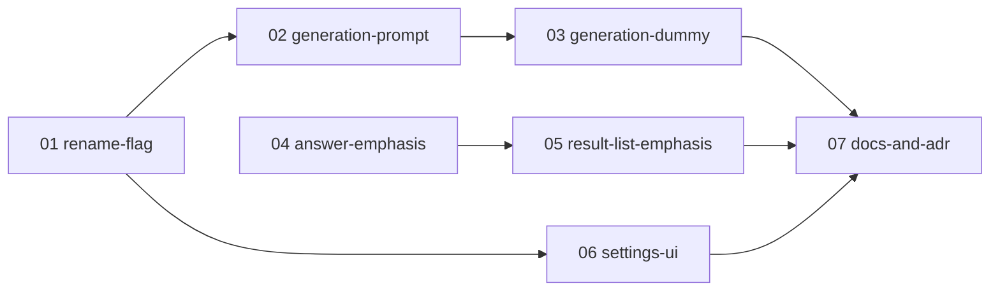

# quiz-first-meaning-only 実装プラン（チケット一覧）

単語テストの訳語表示「先頭の訳語のみ」を形式横断の共通設定へ広げ、自己判定（英→日）の解答側は先頭訳語の赤字で補う機能を、PR 単位のチケットに分割した実装プランの入口。
**quiz-first-meaning-only の実装セッションは、必ずこのファイルと対象チケット 1 ファイルから読み始めること。**

## 設計ドキュメントとの関係

設計の一次情報は [docs/design/quiz-first-meaning-only/README.md](../../design/quiz-first-meaning-only/README.md)。本プランはそれを PR 単位に分割したもの。
各チケットには実装に必要な設計決定が再掲済みのため、原則として設計ドキュメントを読み直す必要はない（再掲の出典参照を深掘りしたい場合のみ「決定 N」を参照する）。
**例外は 07**。ADR は採用理由・却下した代替案そのものが成果物なので、設計トピックを読む前提で書いてある（07 の「前提」に読む対象を列挙）。
設計が改訂された場合は、ticket-split スキルの見直し・追加モードで影響チケットを更新する。

`docs/design/quiz-first-meaning-only/` と `docs/plan/quiz-first-meaning-only/` の削除は、パイプライン終端の feature-close スキルが行う（本プランのチケットには含めない）。

## チケット一覧

番号 = 推奨着手順。状態: `未着手` → `実装中` → `完了`（日付付き）。

| チケット | 概要 | 依存 | 状態 | PR |
| --- | --- | --- | --- | --- |
| [01-rename-flag.md](01-rename-flag.md) | フラグを `firstMeaningTextOnly` / `first_meaning_text_only` へ改名（挙動不変） | なし | 完了（2026-08-15） | - |
| [02-generation-prompt.md](02-generation-prompt.md) | 表示切替ヘルパを新設し、日→英 3 形式の問題文へ設定を効かせる | 01 | 完了（2026-08-15） | - |
| [03-generation-dummy.md](03-generation-dummy.md) | 四択（日→英）で先頭訳語が正解と衝突する単語をダミーから外す | 02 | 未着手 | - |
| [04-answer-emphasis.md](04-answer-emphasis.md) | 自己判定（英→日）の解答表示で先頭訳語を赤字にする | なし | 完了（2026-08-15） | - |
| [05-result-list-emphasis.md](05-result-list-emphasis.md) | 結果一覧の正解列を構造化し、自己判定（英→日）だけ先頭訳語を赤字にする | 04 | 完了（2026-08-15） | - |
| [06-settings-ui.md](06-settings-ui.md) | トグルの表示条件・配置・文言を共通設定として置き直す | 01 | 未着手 | - |
| [07-docs-and-adr.md](07-docs-and-adr.md) | ADR 3 件・用語集・機能紹介・スクリーンショット・E2E 手順書 | 03, 05, 06 | 未着手 | - |

## 依存関係図

02 → 07 は 03 経由の推移的依存なのでエッジを張らない。

並行着手可能なグループ:

- 着手直後: **01 と 04**（04 はフラグに一切触れないため改名を待たない）
- 04 マージ後: **05**（01 の進行状況とは無関係に着手できる）
- 01 マージ後: **02 と 06**（触るファイルが重ならない）
- 02 マージ後: **03**（06・05 がまだなら同時進行でよい）

## チケット横断の共通事項

### 共有物・競合点

**複数チケットが触るファイル**（着手順序の制約あり）:

- `src/lib/quiz/generation/build-quiz.ts`: **01 →（マージ後）02 →（マージ後）03** の直列。01 は `BuildQuizOptions` のフィールド**名**のみ改名（JSDoc の内容更新は 02 が持つ）、02 は `buildQuestions` の 4 case での受け渡しと型コメント、03 は `checkFormatAvailability` の `CHOICE_JA_EN` 分岐を触る
- `src/lib/quiz/generation/choice-ja-en.ts`: **02 →（マージ後）03** の直列。02 は問題文の生成、03 はダミー候補キーを触る
- `src/lib/quiz/generation/build-quiz.unit.test.ts`: **01（改名追随）→ 02（4 形式へ拡張）→ 03（ケース追加）** の直列。既存テスト名に旧識別子・旧前提が含まれる箇所の更新責務は各チケットに明記してある
- `src/app/quiz/_components/start-form.tsx` / `src/app/settings/quiz-defaults/_components/quiz-defaults-form.tsx`: **01 →（マージ後）06** の直列。01 は変数名・`id` 属性のみの機械的改名（**文言・表示条件・配置は触らない**）、06 が表示条件・配置・文言を変える
- `prisma/schema.prisma` / `src/lib/schema/quiz.ts` / `src/lib/quiz-default-settings.ts` / `src/lib/drill-round-generate.integration.test.ts`: **01 →（マージ後）02** の直列。**01 は識別子の改名（コメント・テスト名の中の識別子置換を含む）だけを行い、説明文の本文には触らない**。「四択（英→日）の」という限定表現は、適用先が広がる 02 が直す（01 単独マージ時点ではまだ日→英 3 形式に効かないため、01 が先に書き換えると一時的に虚偽になる）

**主な単独所有のファイル**（網羅ではない。ここに無いものは各チケットの「実装内容」を見る）:

- `src/lib/quiz/generation/material.ts` / `choice.ts` / `choice-ja-en.ts` / `self-judge-ja-en.ts` / `spelling.ts`: 02（`material.ts` は 02 が新設ヘルパを足し docstring を直す。01 は触らない。`choice-ja-en.ts` のみ 03 と直列＝上記参照）
- `src/lib/quiz/generation/dummy-pool.ts`: 03
- `src/components/meaning-text.tsx` / `src/components/placeholder-text.tsx` / `src/app/quiz/_components/question-self-judge.tsx`: **04 が変更**。05 は `MeaningText` の `baseClassName` を**利用するだけ**（04 のマージ後に着手）
- `src/app/quiz/_components/result-list.tsx` / `quiz-flow.tsx` / `src/app/quiz/_lib/correct-answer-display.ts`: 05
- `src/lib/quiz/format-options.ts`: 06（述語新設）
- `src/lib/quiz/default-settings.ts` / `src/app/quiz/_lib/build-start-drill-input.ts` / drill 系の実装（`src/lib/drill-*.ts`）: 01

**意図的に許容している中間不整合**: 06（トグルの表示条件）は 02（日→英 3 形式への適用）に依存させていない。06 が先に入ると、統合ブランチ上で日→英 3 形式にトグルが出るのに効かない期間が生じる。1 機能 1 PR 運用のためユーザーには出ず、07 が 03・06 の両方に依存するので統合 PR 作成前に必ず解消される。並行性を優先した割り切り。

**形式追加時の注意**: 設定が効く形式の集合は、生成側（`build-quiz.ts` の網羅 switch の case）と UI 側（`format-options.ts` の `FIRST_MEANING_TEXT_ONLY_FORMATS`）に**独立して存在する**（[03-ui.md](../../design/quiz-first-meaning-only/03-ui.md) 決定 1 が述語の参照元を開始フォームだけに限定したため）。出題形式を増やすときは両方を更新する。片方だけだと「トグルは出るのに効かない／効くのに出ない」になる。

### 共通規約

- テストは AGENTS.md の規約に従う（`*.unit.test.ts` は `pnpm test:unit`、`*.integration.test.ts` は `pnpm test:integration`。SUT の隣にコロケート）
- マージ前に `pnpm format`（整形）→ `pnpm format:check` / `pnpm lint` / `pnpm typecheck` / `pnpm test:unit` を通す。`pnpm test:integration` は共有 DB を使うため実装エージェントは実行せず、オーケストレーターが直列で実行する
- **UI コンポーネントのテストは書かない**。`vitest.config.mts` の include が `*.unit.test.ts` / `*.integration.test.ts` のみで `.test.tsx` は実行対象外のため、JSX を返す関数の検証は手動確認に委ねる（[03-ui.md](../../design/quiz-first-meaning-only/03-ui.md) 決定 5）。JSX を返さない純関数は JSX から切り離して `*.unit.test.ts` で検証する（別モジュールへ出すか `.tsx` から export するかは裁量。`.tsx` から export した関数を `.unit.test.ts` で import する形も既存の前例がある）
- **マイグレーションは後方互換が無い**。01 の `RENAME COLUMN` を適用したローカル DB では、01 マージ前のブランチのコードは動かない。worktree を切り替えたら `pnpm db:migrate` を先に実行する（AGENTS.md「Worktree」節）
- 用語: 設計・コードの内部呼称は「先頭の訳語」（`firstMeaningTextOnly`）、UI 文言は「最初の訳語」。両者のずれは意図的（[03-ui.md](../../design/quiz-first-meaning-only/03-ui.md) 決定 2）

## ブランチ・PR 運用

統合ブランチ `feature/quiz-first-meaning-only` に 1 チケット = 1 squash コミットで取り込み、機能全体で 1 PR を作る（実行は ticket-implement スキル）。チケットの作業ブランチ名は `feature/quiz-first-meaning-only-NN-<チケット名>`、コミット / PR タイトルは `quiz-first-meaning-only: NN <チケット名>`、着手・マージは依存順。「実装中」= worktree 作成時、「完了」= 統合ブランチへのマージ。PR 列は統合 PR 作成時に全行へ同一 URL を一括記載する。

## ステータス運用ルール

1. **実装セッションは、着手時・PR 作成時・マージ時に、本ファイルのチケット一覧表と対象チケット冒頭の状態行の両方を更新する**（「実装中」「完了」の意味と PR 列の記載タイミングは上の「ブランチ・PR 運用」に従う）。
2. 実装時に計画との差分・後続チケットへの申し送りが生じたら、チケットの「実装メモ」に記入する。
3. **計画の変更（チケットの追加・削除・依存や順序の組み替え・設計改訂の反映）は ticket-split スキルで行う**。実装セッションで勝手にチケットを書き換えない。
