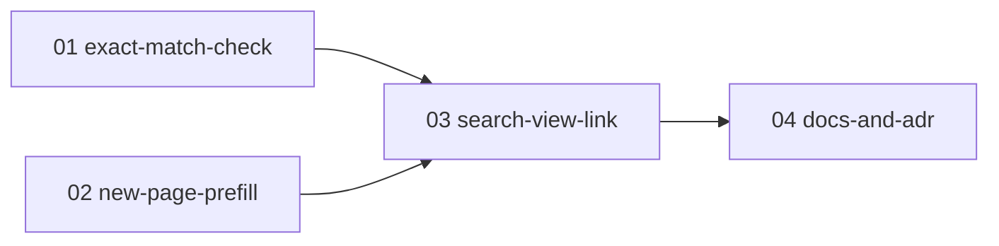

# word-create-from-search 実装プラン（チケット一覧）

単語ビューの検索で見つからなかった語をそのまま登録に進める導線を PR 単位のチケットに分割した実装プランの入口。
**word-create-from-search の実装セッションは、必ずこのファイルと対象チケット 1 ファイルから読み始めること。**

## 設計ドキュメントとの関係

設計の一次情報は [docs/design/word-create-from-search/README.md](../../design/word-create-from-search/README.md)。本プランはそれを PR 単位に分割したもの。
各チケットには実装に必要な設計決定が再掲済みのため、原則として設計ドキュメントを読み直す必要はない（再掲の出典参照を深掘りしたい場合のみ「決定 N」を参照する）。
設計が改訂された場合は、ticket-split スキルの見直し・追加モードで影響チケットを更新する。

## チケット一覧

番号 = 推奨着手順。状態: `未着手` → `実装中` → `完了`（日付付き）。

| チケット | 概要 | 依存 | 状態 | PR |
| --- | --- | --- | --- | --- |
| [01-exact-match-check.md](01-exact-match-check.md) | 完全一致判定関数 `hasExactHeadwordForUser` の追加＋integration テスト | なし | 完了（2026-08-15） | [#260](https://github.com/ganzinn/deja-word/pull/260) |
| [02-new-page-prefill.md](02-new-page-prefill.md) | `/words/new` の受け口（プリフィル導出・returnHref 再構築）＋search-params ヘルパ・`parsePage` 移設＋unit テスト | なし | 完了（2026-08-15） | [#260](https://github.com/ganzinn/deja-word/pull/260) |
| [03-search-view-link.md](03-search-view-link.md) | `WordView` の並列取得＋件数行直下の導線リンク表示 | 01, 02 | 完了（2026-08-15） | [#260](https://github.com/ganzinn/deja-word/pull/260) |
| [04-docs-and-adr.md](04-docs-and-adr.md) | ADR-0084 例外追記・naming-book 記述更新・word-management.md 追記・導線ショット追加 | 03 | 完了（2026-08-15） | [#260](https://github.com/ganzinn/deja-word/pull/260) |

## 依存関係図

並行着手可能なグループ: 01 と 02 は並行可。03 は両方のマージ後、04 は 03 のマージ後。

## チケット横断の共通事項

### 共有物・競合点

複数チケットが触るファイルと着手順序の制約。

- `src/app/words/page.tsx`: 02（`parsePage` 移設に伴う import 差し替えのみ）と 03（`WordView` の並列取得＋導線表示）が触る。03 は 02 のマージ後に着手すること（依存宣言済み）
- `src/app/words/_lib/search-params.ts`・`src/app/words/new/word-form.tsx`: 本プラン内では 02 の単独所有だが、他機能がフォーム・一覧 URL に触れる場合は機能横断で競合しうる（設計ハブの着手順序ヒント参照）

### 共通規約

- テストは AGENTS.md の規約に従う（`*.unit.test.ts` は `pnpm test:unit`、`*.integration.test.ts` は `pnpm test:integration`。SUT の隣にコロケート）
- マージ前に `pnpm format`（整形）→ `pnpm format:check` / `pnpm lint` / `pnpm typecheck` / `pnpm test:unit` を通す。`pnpm test:integration` は共有 DB を使うため実装エージェントは実行せず、オーケストレーターが直列で実行する
- スキーマ（prisma）・migration の変更は本機能には無い。naming-book は新規用語の追加は無いが、既存「検索キーワード正規化」エントリの記述更新がチケット 04 にある

## ブランチ・PR 運用

統合ブランチ `feature/word-create-from-search` に 1 チケット = 1 squash コミットで取り込み、機能全体で 1 PR を作る（実行は ticket-implement スキル）。チケットの作業ブランチ名は `feature/word-create-from-search-NN-<チケット名>`、コミット / PR タイトルは `word-create-from-search: NN <チケット名>`、着手・マージは依存順。「実装中」= worktree 作成時、「完了」= 統合ブランチへのマージ。PR 列は統合 PR 作成時に全行へ同一 URL を一括記載する。

## ステータス運用ルール

1. **実装セッションは、着手時・PR 作成時・マージ時に、本ファイルのチケット一覧表と対象チケット冒頭の状態行の両方を更新する**（「実装中」「完了」の意味と PR 列の記載タイミングは上の「ブランチ・PR 運用」に従う）。
2. 実装時に計画との差分・後続チケットへの申し送りが生じたら、チケットの「実装メモ」に記入する。
3. **計画の変更（チケットの追加・削除・依存や順序の組み替え・設計改訂の反映）は ticket-split スキルで行う**。実装セッションで勝手にチケットを書き換えない。
