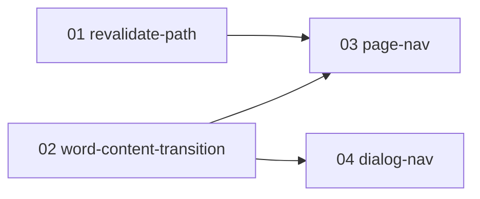

# word-nav-feedback 実装プラン（チケット一覧）

単語詳細の前後ナビ（ボタン／横フリック）の遷移中フィードバック（淡色化＋方向スライド）とプリフェッチによる待ち時間短縮を PR 単位のチケットに分割した実装プランの入口。
**word-nav-feedback の実装セッションは、必ずこのファイルと対象チケット 1 ファイルから読み始めること。**

## 設計ドキュメントとの関係

設計の一次情報は [docs/design/word-nav-feedback/README.md](../../design/word-nav-feedback/README.md)。本プランはそれを PR 単位に分割したもの。
各チケットには実装に必要な設計決定が再掲済みのため、原則として設計ドキュメントを読み直す必要はない（再掲の出典参照を深掘りしたい場合のみ「決定 N」を参照する）。
設計が改訂された場合は、ticket-split スキルの見直し・追加モードで影響チケットを更新する。

## チケット一覧

番号 = 推奨着手順。状態: `未着手` → `実装中` → `完了`（日付付き）。

| チケット | 概要 | 依存 | 状態 | PR |
| --- | --- | --- | --- | --- |
| [01-revalidate-path.md](01-revalidate-path.md) | 単語データ変更 Server Action に `revalidatePath` 追加（プリフェッチ導入の前提整備） | なし | 未着手 | - |
| [02-word-content-transition.md](02-word-content-transition.md) | 共通表示コンポーネント `WordContentTransition`（淡色化＋方向スライド）＋方向→クラス純関数 | なし | 未着手 | - |
| [03-page-nav.md](03-page-nav.md) | ページ側配線: `WordNavArea`・方向ストア・`adjacent-word-nav` 改修・`prefetch={true}` | 01, 02 | 未着手 | - |
| [04-dialog-nav.md](04-dialog-nav.md) | ダイアログ側: 淡色化表示への変更＋ Map キャッシュ・前後 1 件先読み | 02 | 未着手 | - |

## 依存関係図

並行着手可能なグループ: 01 と 02 は並行可。03 と 04 は互いに独立（03 は 01・02 のマージ後、04 は 02 のマージ後に着手可）。

## チケット横断の共通事項

### 共有物・競合点

複数チケットが触るファイルと着手順序の制約。

- `src/components/word-content-transition.tsx`・`word-content-transition-classes.ts`: 02 が作成し、03・04 は import して使うのみ（変更しない）。仕様不足が見つかった場合は 03・04 内で直接変更せず、02 の追加改修（別 PR）として切り出すか ticket-split の見直し・追加モードで扱う
- `src/app/globals.css`: 02 のみ追記があり得る。03・04 は触らない
- `src/app/words/[id]/_components/adjacent-word-nav.tsx`: 03 のみが触る（`prefetch={true}` を 01 でなく 03 に寄せ、同一ファイル競合を回避した。01→03 の依存で「revalidatePath とセット」の制約を担保する）

### 共通規約

- テストは AGENTS.md の規約に従う（`*.unit.test.ts` は `pnpm test:unit`、`*.integration.test.ts` は `pnpm test:integration`。SUT の隣にコロケート）
- マージ前に `pnpm lint` / `pnpm typecheck` / 該当テストを通す
- `data-*` 属性名（`data-pending` / `data-direction`）と型 `WordNavDirection` は 02 が定義し、03・04 はそのまま使う（再定義しない）
- E2E はプリフェッチ・先読みに依存させない（[03-prefetch.md](../../design/word-nav-feedback/03-prefetch.md) 決定 5）。プリフェッチの効果確認は `pnpm build && pnpm start` の目視
- `docs/features/` の更新責務: 単語詳細ページ分は 03、単語テスト（ダイアログ）分は 04

## ブランチ・PR 運用

- ブランチ名: `feat/word-nav-feedback-NN-<チケット名>`（リポジトリ慣行・`scripts/wt-new.sh` の `feat/` プレフィックスに合わせる）
- PR タイトル: `word-nav-feedback: NN <チケット名>`
- マージは依存順（依存先チケットの PR がマージされてから着手・マージする）
- 運用メモ: 単一ブランチ統合モードで実装中（統合ブランチ `feat/word-nav-feedback`。各チケットは統合ブランチへ squash マージし、最後に main への統合 PR を 1 本作成する）

## ステータス運用ルール

1. **実装セッションは、着手時・PR 作成時・マージ時に、本ファイルのチケット一覧表と対象チケット冒頭の状態行の両方を更新する**（PR 作成済み・未マージは「実装中」＋PR リンクで表現する）。
2. 実装時に計画との差分・後続チケットへの申し送りが生じたら、チケットの「実装メモ」に記入する。
3. **計画の変更（チケットの追加・削除・依存や順序の組み替え・設計改訂の反映）は ticket-split スキルで行う**。実装セッションで勝手にチケットを書き換えない。
