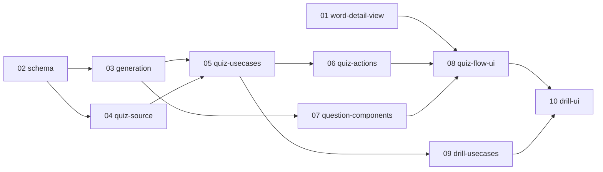

# word-quiz 実装プラン（チケット一覧）

単語テスト機能（quiz。登録済み英単語の腕試しテスト＋定着モード drill）を PR 単位のチケットに分割した実装プランの入口。
**word-quiz の実装セッションは、必ずこのファイルと対象チケット 1 ファイルから読み始めること。**

## 設計ドキュメントとの関係

設計の一次情報は [docs/design/word-quiz/README.md](../../design/word-quiz/README.md)。本プランはそれを PR 単位に分割したもの。
各チケットには実装に必要な設計決定が再掲済みのため、原則として設計ドキュメントを読み直す必要はない（再掲の出典参照を深掘りしたい場合のみ参照先を読む）。
出典参照の形式: `05-architecture.md` / `06-drill-mode.md` は「決定 N」見出し、`01`〜`04` は決定セクションの見出し名で参照する（これらのファイルに「決定 N」形式の見出しはないため）。
設計が改訂された場合は、ticket-split スキルの見直し・追加モードで影響チケットを更新する。

## チケット一覧

番号 = 推奨着手順。状態: `未着手` → `実装中` → `完了`（日付付き）。

| チケット | 概要 | 依存 | 状態 | PR |
| --- | --- | --- | --- | --- |
| [01-word-detail-view.md](01-word-detail-view.md) | `/words/[id]` の表示部を `src/components/word-detail-view.tsx` に抽出（表示は不変のリファクタ） | なし | 完了（2026-06-13） | - |
| [02-schema.md](02-schema.md) | QuizAnswer / Drill / DrillWord ＋ enum 3 つのマイグレーション一括 1 回、tx-mock delegate 追加 | なし | 完了（2026-06-13） | - |
| [03-generation.md](03-generation.md) | RNG 注入の問題生成純関数群＋`payload.ts`＋シード付き PRNG ヘルパ（unit test 込み） | 02 | 完了（2026-06-13） | - |
| [04-quiz-source.md](04-quiz-source.md) | 素材取得クエリ `fetchQuizSource`＋fixture 追加（integration test 込み） | 02 | 完了（2026-06-13） | - |
| [05-quiz-usecases.md](05-quiz-usecases.md) | quiz 系 UseCase 3 本＋quiz-answer-handler・handlers/shared（unit＋integration） | 03, 04 | 未着手 | - |
| [06-quiz-actions.md](06-quiz-actions.md) | quiz 系 4 Server Action＋zod スキーマ＋error-map（unit test 込み） | 05 | 未着手 | - |
| [07-question-components.md](07-question-components.md) | 出題形式 3 コンポーネント（四択／自己判定／多義語選択、即時フィードバック込み） | 03 | 未着手 | - |
| [08-quiz-flow-ui.md](08-quiz-flow-ui.md) | `/quiz` ページ＋テストフロー UI 一式（開始→カウントダウン→出題→結果） | 01, 06, 07 | 未着手 | - |
| [09-drill-usecases.md](09-drill-usecases.md) | drill 系 UseCase 5 本＋drill-round-handler（CAS 冪等の integration 込み） | 05 | 未着手 | - |
| [10-drill-ui.md](10-drill-ui.md) | drill 系 4 Action＋drill UI 差分＋ダッシュボード「単語テスト」ボタン（最終配線） | 08, 09 | 未着手 | - |

## 依存関係図

並行着手可能なグループ:

- 01 と 02 は並行可（初期状態で着手できるのはこの 2 つ）
- 02 のマージ後: 03 と 04 は並行可
- 03 のマージ後: 07 は 04〜06 と並行可
- 05 のマージ後: 09 は 06〜08 と並行可

## チケット横断の共通事項

### 共有物・競合点

複数チケットが触るファイルと着手順序の制約。

- `src/app/quiz/actions.ts` / `src/lib/quiz/error-map.ts` / `src/lib/schema/quiz.ts`: 06（quiz 系を新規作成）→ 10（drill 系を追記）の直列。設計ハブの「テスト系 → drill 系の順が安全」に従う
- `src/app/quiz/page.tsx` / `_components/quiz-flow.tsx` / `_components/start-form.tsx` / `_components/result-list.tsx`: 08（テストフローとして新規作成）→ 10（drill 差分を追記）の直列
- `src/app/words/[id]/page.tsx`・単語詳細の表示部: 01 が抽出を先行。08 は `src/components/word-detail-view.tsx` を import するのみで `/words/[id]` には触れない
- `tests/setup/fixtures.ts`: 04 で fixture を追加。09 が再利用（不足分は 09 で追記。04 → 09 は 05 経由の直列依存のため競合しない）
- `tests/setup/tx-mock.ts`: 02 のみが触る（quizAnswer / drill / drillWord の 3 delegate を一括追加）

### 共通規約

- テストは AGENTS.md の規約に従う（`*.unit.test.ts` は `pnpm test:unit`、`*.integration.test.ts` は `pnpm test:integration`。SUT の隣にコロケート）
- マージ前に `pnpm lint` / `pnpm typecheck` / 該当テストを通す
- マイグレーションは 02 の一括 1 回のみ。以降のチケットでスキーマ変更が必要になったら実装せず ticket-split（設計改訂なら design-session）へ差し戻す
- 命名はコード上 `quiz` / `drill` を基準とし、UI 表示の日本語は「単語テスト」「定着モード」を使う
- `src/lib/quiz/` 配下の純関数・payload には `server-only` を付けない（クライアントからの型 import を許すため）。UseCase・クエリ側が server-only を担う

## ブランチ・PR 運用

- 運用メモ: 単一ブランチ統合モードで実装中（統合ブランチ `feature/word-quiz`、2026-06-13 開始）
- ブランチ名: `feature/word-quiz-NN-<チケット名>`
- PR タイトル: `word-quiz: NN <チケット名>`
- マージは依存順（依存先チケットの PR がマージされてから着手・マージする）

## ステータス運用ルール

1. **実装セッションは、着手時・PR 作成時・マージ時に、本ファイルのチケット一覧表と対象チケット冒頭の状態行の両方を更新する**（PR 作成済み・未マージは「実装中」＋PR リンクで表現する）。
2. 実装時に計画との差分・後続チケットへの申し送りが生じたら、チケットの「実装メモ」に記入する。
3. **計画の変更（チケットの追加・削除・依存や順序の組み替え・設計改訂の反映）は ticket-split スキルで行う**。実装セッションで勝手にチケットを書き換えない。
