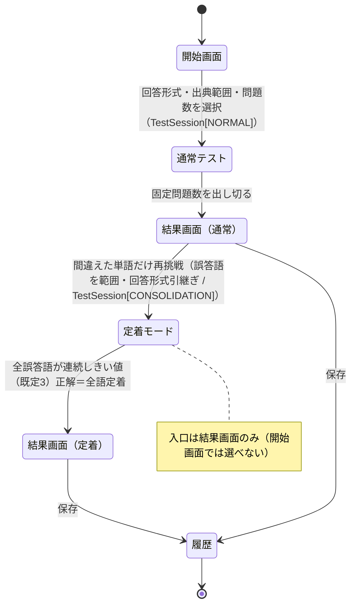
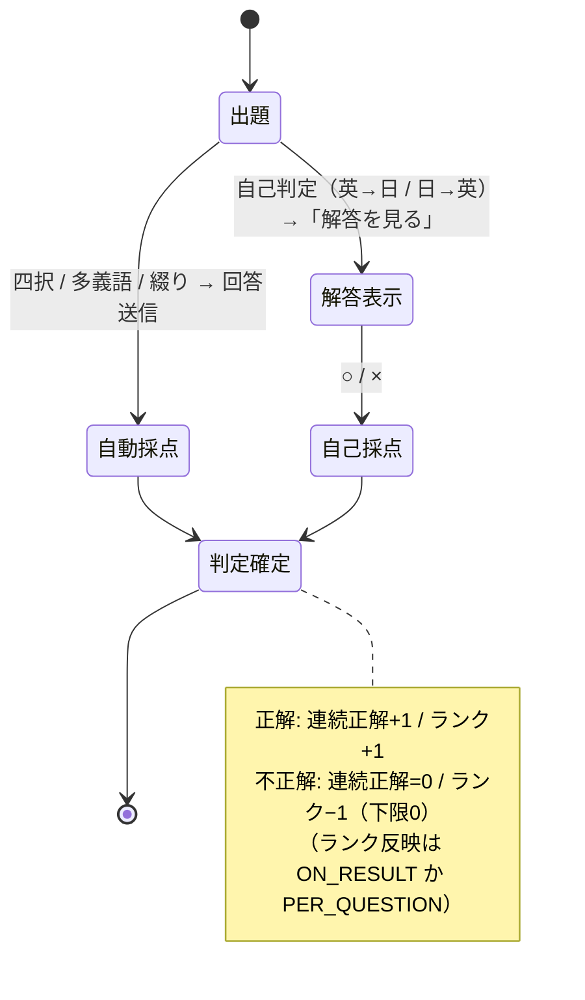
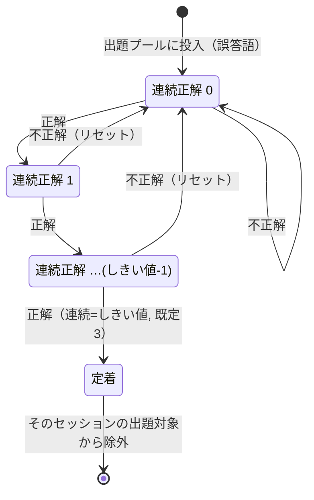
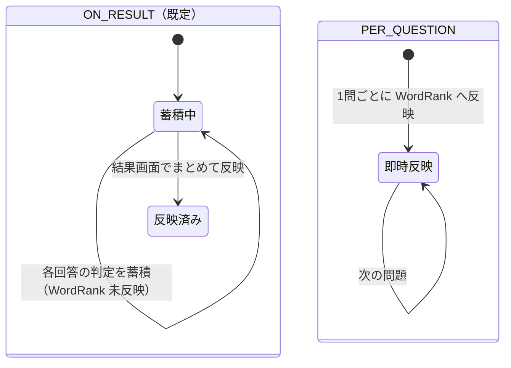

# 単語テスト機能 仕様

## Context

`deja-word` は「一度忘れた単語との再会体験」をコンセプトとする英単語学習アプリ。基盤整備フェーズ（M1〜M5）と単語登録/一覧/出典管理が実装済みで、ユーザーは自分の単語（`owner_id = <user>`）とシステム共有単語（`owner_id = "system"`）を扱える。

本書は **「登録した単語を覚えるためのテスト機能」** の仕様。複数の回答形式と、ランクによる定着度管理、「全部覚えるまで繰り返す」定着モードを定義する。データモデルは未実装のため、本書で新規モデルも設計する。

> 表記: 本書中で **確定** はユーザーとのすり合わせで合意済みの事項、**提案（要確認）** は本書で初めて設計した、合意前の事項。実装着手前に「未確定事項」セクションを潰すこと。

---

## 用語と 2 つの軸

テストの挙動は **2 軸** で決まる（厳密には直交しない＝定着モードは独立に選べない。下記参照）。混同しやすいので最初に分離する。

| 軸 | 何を決めるか | 取りうる値 |
|---|---|---|
| **出題範囲モード**（scope mode） | どの単語を、どういう打ち切り条件で出すか | 通常 / 定着モード |
| **回答形式モード**（answer-format mode） | 1 問の出し方・答え方・採点方法 | 四択 / 多義語 / 綴り / 自己判定（英→日）/ 自己判定（日→英） |

- 定着モードは **出題範囲モード** であって回答形式ではない（重要）。定着モードでも、回答形式は 1 つを使う。
- **定着モードは開始画面では選べない**。通常テストの**結果画面**から「間違えた単語だけ再挑戦」で入り、誤答語を出題範囲・親テストの回答形式を引き継いで開始する（→ 図① / 「出題範囲モード」節）。`TestScopeMode.CONSOLIDATION` はユーザーが直接選ぶ値ではなく、この導線で生成されるセッションの内部値。
- ランクは **回答形式モードごとに独立** して持つ（後述）。「四択ではランク 3 だが綴りではランク 0」がありうる。

---

## 確定した方針（すり合わせ済み）

| 項目 | 決定 |
|---|---|
| 回答形式モード | **5 種**: ①四択（語義選択） ②多義語（訳語の複数選択） ③綴り（日→英 記述） ④自己判定（英→日 / 意味想起） ⑤自己判定（日→英 / 語想起） |
| ランクの粒度 | **5 モードそれぞれに独立したランク**を持つ（単語 × モードでランク 1 つ） |
| ランクの範囲 | **下限 0、上限なし**（0 以上の整数） |
| ランク更新（既定） | 正解 → **+1（上限なし）** / 不正解 → **−1（下限 0）** |
| ランクの位置づけ | **長期の習熟度の目安・出題優先度**に使う。**定着判定には使わない** |
| 定着判定（別指標） | **ランクとは別**に評価する。**1 テストセッション内で連続しきい値（既定 3）回正解**したら、その回答形式モードで「定着」とみなす。連続正解カウンタはセッション内で持ち、不正解で 0 にリセット。「セッション内のやり直し」は**定着モード内の反復出題**を指す |
| 定着しきい値 | 連続正解の必要回数。**`UserTestSetting.consolidationThreshold`（既定 3）で設定可能** |
| 自己判定の採点 | 解答表示後に **○ / × の 2 ボタン**で自己採点。○ = 正解、× = 不正解として **ランク・連続正解の両方に算入**（他モードと同じ扱い） |
| ランク反映タイミング | **既定は結果画面でまとめて反映**。設定で **「1 問ごとに即時反映」** にも切り替え可能 |
| 定着モード | **出題範囲モード**の一種。**開始画面では選べず、通常テストの結果画面からのみ**入る（誤答語を出題範囲・親テストの回答形式を引き継ぐ）。出題範囲の**全対象がセッション内で連続しきい値（既定 3）回正解（＝定着）するまで**出題を続ける |
| 定着モードで定着した単語 | そのセッションの**出題対象から完全に外す**（その語は打ち切り）。残りの未定着語に集中する |
| 通常テストでの扱い | 定着判定では打ち切らない（固定の問題数を出して終了）。ランクは出題優先度・並びに利用できる |
| 結果画面 | **詳細結果**（正解数 / 正答率、**出題した全問題の一覧＝正解・不正解の両方**を正解と自分の回答付きで表示、ランク変動） |
| 再挑戦 | 結果画面の **「間違えた単語だけ再挑戦」** は、誤答語を範囲にした**定着モードの開始**（独立機能ではない）|
| 履歴 | テストごとの成績を **回答形式モード別に記録**して閲覧できる |

---

## 回答形式モード（5 種）詳細

すべて対象は **出題範囲内の単語**。出題対象・選択肢ともに **`scopedOwnerIds(user) = [system, user]`** の単語プールから引く（自分の単語＋システム共有単語）。

データ参照は `Word.headword`（英単語）/ `Meaning`（語義: 品詞・発音・注記）/ `MeaningText`（訳語: 実際の日本語テキスト）の関係を用いる。1 単語は複数 `Meaning` を持て、各 `Meaning` は複数 `MeaningText` を持つ（＝多義語）。

### ① 四択（語義選択） / `FOUR_CHOICE`
- **出題**: `headword` を提示。
- **解答**: 4 つの語義（日本語）から正しいものを 1 つ選ぶ。
- **採点**: 自動。正解の語義を選べば正解。
- **選択肢**: 正解 = 対象語の語義（代表 `MeaningText`）。誤答 3 = 他語の語義。
- **出題条件**: 対象語に `MeaningText` が 1 つ以上あること。

### ② 多義語（訳語の複数選択） / `POLYSEMY`
- **出題**: `headword` を提示。
- **解答**: 訳語候補（日本語）の一覧から、その単語の訳語を**すべて選ぶ**（select all that apply）。
- **採点**: 自動。対象語の訳語集合と完全一致で正解（過不足があれば不正解）。
- **選択肢**: 正解 = 対象語の全 `MeaningText`。ダミー = 他語の `MeaningText`。
- **出題条件**: 対象語に `MeaningText` が 1 つ以上あること（訳語が複数ある語ほど効果的）。

### ③ 綴り（日→英 記述） / `SPELLING`
- **出題**: 語義 / 訳語（日本語）を提示。
- **解答**: `headword` の綴りをテキスト入力。
- **採点**: 自動。入力と `headword` を正規化して一致判定（→ 判定基準は「未確定事項」）。
- **出題条件**: 対象語に `MeaningText` が 1 つ以上あること（提示用）。

### ④ 自己判定（英→日 / 意味想起） / `SELF_EN_JA`
- **出題**: `headword` を提示。意味を頭の中で想起。
- **解答**: 「解答を見る」で語義（日本語）を表示 → **○ / ×** で自己採点。
- **採点**: 自己判定。○ = 正解、× = 不正解としてランクに算入。

### ⑤ 自己判定（日→英 / 語想起） / `SELF_JA_EN`
- **出題**: 語義 / 訳語（日本語）を提示。英単語を頭の中で想起。
- **解答**: 「解答を見る」で `headword`（＋発音等）を表示 → **○ / ×** で自己採点。
- **採点**: 自己判定。○ = 正解、× = 不正解としてランクに算入。

---

## ランクシステム

- 単位は **(学習者ユーザー, 単語, 回答形式モード)**。値は **0 以上の整数（上限なし）**。
  - 注意: 単語はシステム共有（`owner_id = "system"`）でも、**ランクは学習者ごと**に持つ。ランク行のキーは単語の所有者ではなく**学習者**。
- 既定の更新規則:
  - 正解（自己判定は ○）: `rank = rank + 1`（上限なし）
  - 不正解（自己判定は ×）: `rank = max(rank - 1, 0)`（下限 0）
- 反映タイミング（ユーザー設定）:
  - `ON_RESULT`（**既定**）: テスト中は判定だけ蓄積し、結果画面でまとめてランクへ反映。
  - `PER_QUESTION`: 1 問回答するたび即時にランクへ反映。
- ランクは**長期の習熟度の目安・出題優先度**に使う。**定着判定には使わない**（定着判定は次節）。

---

## 定着判定（連続正解）

ランクとは独立した、**テストセッション内の連続正解**で「定着」を判定する別指標。

- 単位は **(テストセッション, 単語, 回答形式モード)** の**連続正解カウンタ**。
- セッション中、その語に **正解（自己判定は ○）するたび +1**、**不正解（×）で 0 にリセット**。
- カウンタが **しきい値（既定 3）に達したら、その語はそのセッションで「定着」**とみなす。しきい値は `UserTestSetting.consolidationThreshold` で設定可能。
- ここでの連続正解は**定着モード内の反復出題**を通じて積み上がる（定着モードは未定着語を繰り返し出題するため、自然に連続正解を狙える）。
- カウンタは**セッションスコープ**（次セッションでは 0 から）。**専用の永続カラムは持たず、実行中はランタイム状態で保持**する。永続化された `TestSessionItem` の (order, correct) から再導出も可能（中断・再開時の復元に使える）。
- 主に**定着モードの打ち切り条件**に使う。通常モードでも結果の参考集計に使ってよい。
- **語ごとの「定着済み」フラグは永続化しない**（セッション内の判定のみ）。ただし定着モードのセッション自体は `TestSession`（`scopeMode = CONSOLIDATION`）として履歴に残る。

---

## 出題範囲モード

### 通常モード（`NORMAL`）
- 出題範囲（**出典(Occurrence)単位を主軸**。詳細は「未確定事項」）から、選んだ回答形式モードで出題。
- **定着判定では打ち切らない**（固定の問題数を出して終了）。ランクは出題優先度・並びに利用できる。
- 問題数 / 出題順 → 「未確定事項」。

### 定着モード（`CONSOLIDATION`）
- **入口は結果画面のみ**。通常テストの結果画面で「間違えた単語だけ再挑戦」を選ぶと、**誤答語を出題範囲**・**親テストの回答形式を引き継いで**定着モードのセッションを開始する（開始画面では選べない）。
- **打ち切り条件**: 出題範囲（＝誤答語）の**全対象が、そのセッション内で連続しきい値（既定 3）回正解（＝定着）する**まで出題を続ける。
- 定着に達した語は**そのセッションの出題対象から外す**。残りの未定着語（連続正解 < しきい値）を反復出題する。間違えた語ほど重点的に再出題する（出題順は「未確定事項」）。
- 不正解で連続正解カウンタが 0 に戻った語は、再びしきい値連続を積み直す必要がある（自然に反復される）。
- ランクは各回答で +1 / −1 を続けるが、**打ち切りはランクではなく連続正解で判定**する。
- 1 回の定着モードを 1 セッションとして連続実行する想定。`TestSessionItem` を永続化するため**中断・再開も可能**（items から連続正解カウンタを復元）。UX 詳細は「未確定事項」。

---

## 状態遷移図

### 図① テストセッション ライフサイクル（定着モードの入口は結果画面のみ）



### 図② 1 問の回答フロー（回答形式別）



### 図③ 定着モード — 単語ごとの連続正解カウンタ（核心）



### 図④ ランク反映タイミング設定（UserTestSetting）



---

## 結果画面・履歴・再挑戦

### 結果画面（テスト終了時）
- サマリ: 正解数 / 出題数、正答率。
- **出題した全問題の一覧**（正解・不正解の**両方**を表示。正誤で見分けられるようにする）: 各問 `headword` ＋ 正解（語義 / 訳語 / 綴り）＋ 自分の回答を併記。
  - 定着モードは同じ語が複数回出るため、必要なら単語単位に集約して表示してよい。
- ランク変動: モードごとの各単語の before → after（`ON_RESULT` ならここで初めて反映）。
- 動線: **「間違えた単語だけ再挑戦」**＝誤答語を範囲・同じ回答形式で**定着モードを開始**する（→「定着モード」節）。

### 履歴
- テスト 1 回 = 履歴 1 件。回答形式モード別に記録・絞り込みできる。
- 各件: 実施日時、回答形式モード、出題範囲モード、出題数 / 正解数 / 正答率。
- 詳細＝1 問単位の記録は `TestSessionItem` として**永続化する**（各問の正誤・自分の回答・ランク変動を後から閲覧できる）。

---

## データモデル（提案 / Prisma）

既存規約に合わせる: cuid 主キー、`@map` でスネークケース列、`owner_id` 等。Prisma 7（driver adapter、`@/generated/prisma/client` から import）。

> 命名注意: 進捗・履歴の所有者は**学習者**を指すため、本モデルでは `userId` を用いる（単語側の `ownerId` とは別概念。システム共有単語に対しても学習者ごとの行を作る）。

```prisma
enum TestMode {
  FOUR_CHOICE  // 四択（語義選択）
  POLYSEMY     // 多義語（訳語複数選択）
  SPELLING     // 綴り（日→英）
  SELF_EN_JA   // 自己判定（英→日 / 意味想起）
  SELF_JA_EN   // 自己判定（日→英 / 語想起）
}

enum TestScopeMode {
  NORMAL
  CONSOLIDATION  // 定着モード
}

enum RankReflectTiming {
  ON_RESULT      // 結果画面でまとめて反映（既定）
  PER_QUESTION   // 1 問ごとに即時反映
}

/// (学習者, 単語, 回答形式モード) ごとのランク。0 以上・上限なし。
model WordRank {
  id             String    @id @default(cuid())
  userId         String    @map("user_id")   // 学習者（単語所有者ではない）
  wordId         String    @map("word_id")
  mode           TestMode
  rank           Int       @default(0)        // 0 以上、上限なし
  correctCount   Int       @default(0) @map("correct_count") // 累積正答数（統計・出題優先度の補助。定着判定には使わない）
  wrongCount     Int       @default(0) @map("wrong_count")   // 累積誤答数（同上）
  lastAnsweredAt DateTime? @map("last_answered_at")
  updatedAt      DateTime  @updatedAt @map("updated_at")

  user User @relation(fields: [userId], references: [id], onDelete: Cascade)
  word Word @relation(fields: [wordId], references: [id], onDelete: Cascade)

  @@unique([userId, wordId, mode])
  @@index([userId, mode])
  @@index([wordId])
  @@map("word_rank")
}

/// テスト 1 回 = 履歴 1 件。
model TestSession {
  id           String        @id @default(cuid())
  userId       String        @map("user_id")
  mode         TestMode
  scopeMode       TestScopeMode @default(NORMAL) @map("scope_mode")
  parentSessionId String?       @map("parent_session_id") // 定着モード時、由来の通常テスト（任意）
  scope        Json?         // 範囲指定。{ kind: "occurrences" | "words", ids: string[] }（通常=出典ID / 定着=誤答語ID）
  totalCount   Int           @map("total_count")    // 延べ出題回数（定着モードは同語が複数回出る）
  correctCount Int           @default(0) @map("correct_count") // 延べ正解回数
  startedAt    DateTime      @default(now()) @map("started_at")
  finishedAt   DateTime?     @map("finished_at")

  user  User              @relation(fields: [userId], references: [id], onDelete: Cascade)
  items TestSessionItem[]

  @@index([userId, mode])
  @@index([userId, startedAt])
  @@map("test_session")
}

/// 1 問単位の記録（結果詳細・履歴詳細用）。永続化する（採用確定）。
model TestSessionItem {
  id         String  @id @default(cuid())
  sessionId  String  @map("session_id")
  wordId     String  @map("word_id")
  order      Int
  correct    Boolean
  rankBefore Int?    @map("rank_before") // ON_RESULT は結果確定時に order 順リプレイで埋める
  rankAfter  Int?    @map("rank_after")  // 同上

  session TestSession @relation(fields: [sessionId], references: [id], onDelete: Cascade)
  word    Word        @relation(fields: [wordId], references: [id], onDelete: Cascade)

  @@index([sessionId])
  @@index([wordId])
  @@map("test_session_item")
}

/// テストに関するユーザー設定。
model UserTestSetting {
  userId                 String            @id @map("user_id")
  rankReflectTiming      RankReflectTiming @default(ON_RESULT) @map("rank_reflect_timing")
  consolidationThreshold Int               @default(3) @map("consolidation_threshold") // 定着とみなす連続正解回数（既定3）
  updatedAt              DateTime          @updatedAt @map("updated_at")

  user User @relation(fields: [userId], references: [id], onDelete: Cascade)

  @@map("user_test_setting")
}
```

`User` 側に逆リレーション（`wordRanks` / `testSessions` / `userTestSetting`）、`Word` 側に `ranks` / `testSessionItems` を追加する。マイグレーションは新規 1 本（既存 SQL は編集しない）。定着判定の連続正解カウンタは**専用カラムを持たず、実行中はランタイム状態で保持**し、必要時に `TestSessionItem` の (order, correct) から再導出する。`parentSessionId` の自己リレーション（`parent` / `children`）を張るかは実装時判断（最小実装では scalar のみで可）。

---

## 画面・ルート構成（提案 / 要確認）

| ルート | 役割 |
|---|---|
| `/test` | 開始画面。**通常テストのみ**を開始（回答形式モード・出題範囲（出典）・問題数を選ぶ）。定着モードは結果画面から入るためここには出さない |
| `/test/session/[id]` | テスト実行（1 問ずつ）。自己判定は「解答を見る → ○/×」 |
| `/test/session/[id]/result` | 結果画面（サマリ・間違い一覧・ランク変動・再挑戦動線） |
| `/test/history` | 履歴一覧（モード別フィルタ） |
| `/settings`（既存に追記） | ランク反映タイミングの設定 |

保護方針: `proxy.ts` の matcher に `/test/:path*` を追加（現状の matcher は `/dashboard`・`/words` のみ。`/settings` はページ内の `getCurrentSession()` だけで保護）＋各ページで `getCurrentSession()`。Server Action はオーナー（学習者）スコープを徹底。

---

## 未確定事項（実装前に確定する）

> 本セッションで確定し、上記各節へ反映済みのもの: 出題範囲＝**出典(Occurrence)単位**主軸（旧 #1）／`TestSessionItem`＝**永続化する**（旧 #9）／再挑戦のランク反映＝**通常どおり更新**（旧 #10。再挑戦＝定着モードのため各回答で +1/−1）／定着しきい値＝**設定可能（既定 3）**／定着モードの入口＝**結果画面のみ**／定着の数え方＝**各語が連続しきい値（既定 3）回正解**。

1. **`TestSession.scope` の表現**: `{ kind, ids }` の JSON を提案（出典 ID 配列／誤答語 ID 配列）。中間テーブル化するかは要検討。
2. **1 テストの問題数**: 固定 N / ユーザー指定 / 範囲全部。通常モードの既定値。
3. **出題順**: 通常＝ランダム / 低ランク優先 / 登録順。定着モード＝**誤答語を重点的に高頻度**（提案）。
4. **四択・多義語の誤答（distractor）選定**: 同品詞優先か、ランダムか。重複・正解の混入防止規則。プールが少ない場合のフォールバック（選択肢が埋まらないとき）。
5. **綴りの正誤判定基準**: 前後 trim・大文字小文字無視・連続空白正規化での完全一致を**提案**。別綴り（米英差など）複数正解の許容、記号（ハイフン/アポストロフィ）の扱い。
6. **多義語モードの選択肢数**: 候補プールの総数、正解数の見せ方（正解数を提示するか）。
7. **各モードの出題可能条件の最終確定**: 訳語ゼロの単語の除外、システム単語の出題可否（既定は出す想定）。
8. **定着モードの中断・再開の UX**: `TestSessionItem` 永続化により**再開は技術的に可能**（items から連続正解カウンタを復元）。どこで中断を許すか・再開導線の UX は要設計。

---

## 実装フェーズ分割（提案）

1. **データモデル**: 上記モデル＋マイグレーション、`WordRank` 読み書きの最小ヘルパー（`src/lib/test/*`）。ユニット/インテグレーションテストはコロケート（`*.unit.test.ts` / `*.integration.test.ts`）。
2. **出題エンジン**: 範囲→出題リスト生成、モード別の問題生成（選択肢・正解）、採点関数（pure 関数中心でユニットテスト）。
3. **通常テスト UI**: 開始画面 → 実行 → 結果（`ON_RESULT` 反映）。回答形式 5 種を順次。
4. **ランク反映タイミング設定** と `PER_QUESTION`。
5. **定着モード**（連続正解での打ち切り・出題プール管理）。
6. **履歴**（`TestSession` 一覧、必要なら `TestSessionItem` 詳細）。
7. **間違い再挑戦**。
