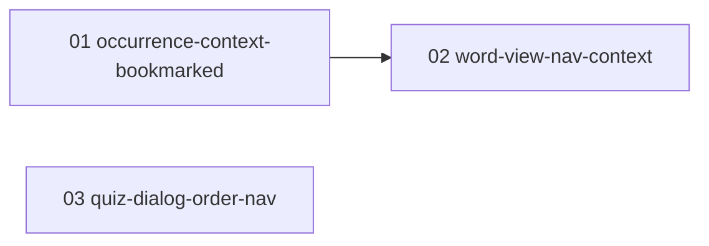

# word-view-nav 実装プラン（チケット一覧）

単語詳細の前後ナビ（詳細ページ・テスト結果ダイアログ）を「直前に見ていた一覧の並び・絞り込み」に追随させる機能を PR 単位のチケットに分割した実装プランの入口。
**word-view-nav の実装セッションは、必ずこのファイルと対象チケット 1 ファイルから読み始めること。**

## 設計ドキュメントとの関係

設計の一次情報は [docs/design/word-view-nav/README.md](../../design/word-view-nav/README.md)。本プランはそれを PR 単位に分割したもの。
各チケットには実装に必要な設計決定が再掲済みのため、原則として設計ドキュメントを読み直す必要はない（再掲の出典参照を深掘りしたい場合のみ「決定 N」を参照する）。
設計が改訂された場合は、ticket-split スキルの見直し・追加モードで影響チケットを更新する。

## チケット一覧

番号 = 推奨着手順。状態: `未着手` → `実装中` → `完了`（日付付き）。

| チケット | 概要 | 依存 | 状態 | PR |
| --- | --- | --- | --- | --- |
| [01-occurrence-context-bookmarked.md](01-occurrence-context-bookmarked.md) | 掲載箇所コンテキストに `bookmarked` を追加（詳細リンク・隣接クエリ・戻りリンクへ反映） | なし | 完了（2026-08-07） | - |
| [02-word-view-nav-context.md](02-word-view-nav-context.md) | コンテキスト union 化＋`view=word` 判別＋単語ビュー隣接クエリ＋ページ配線＋docs（features / ADR / naming-book） | 01 | 実装中 | - |
| [03-quiz-dialog-order-nav.md](03-quiz-dialog-order-nav.md) | テスト結果ダイアログを結果一覧順のクライアント配列ナビへ変更（隣接 action 廃止）＋docs（features / ADR / 0086 注記） | なし | 完了（2026-08-07） | - |

## 依存関係図

並行着手可能なグループ: 01 と 03 は並行可。02 は 01 のマージ後に着手する。

## チケット横断の共通事項

### 共有物・競合点

複数チケットが触るファイルと着手順序の制約。

- `src/app/words/_lib/search-params.ts`（＋ `search-params.unit.test.ts`）: 01 が `bookmarked` 追加、02 が union 化。直列依存（01 → 02）で解決
- `src/app/words/page.tsx` / `src/app/words/[id]/page.tsx`: 01 が bookmarked 配線、02 が kind 分岐。直列依存（01 → 02）で解決
- `src/lib/words-list.ts`（＋ `words-list.integration.test.ts`）: 01 が `bookmarkedOnly` 追加、02 が where ビルダ抽出＋隣接クエリ新設、03 が `findAdjacentWordsByOccurrenceNumber`（と対応 describe）の削除。01 → 02 は直列。**03 は別関数の削除のみで領域が重ならないため並行着手可**だが、01 / 02 のどちらかと同時にマージが重なる場合は後からマージする側が rebase で解消する
- `docs/adr/README.md`: 02（ADR ①）と 03（ADR ②）が一覧表の末尾に行を追記する。後からマージする側が rebase で番号・行順を揃える（番号ルールは共通規約参照）

### 共通規約

- テストは AGENTS.md の規約に従う（`*.unit.test.ts` は `pnpm test:unit`、`*.integration.test.ts` は `pnpm test:integration`。SUT の隣にコロケート）
- マージ前に `pnpm lint` / `pnpm typecheck` / 該当テストを通す
- ユーザー向け機能の変更を含む PR は `docs/features/` の該当ドキュメントを同 PR で更新する（AGENTS.md。スクリーンショットの再撮影は本機能では不要 — [04-ui-architecture.md](../../design/word-view-nav/04-ui-architecture.md) 決定 5）。例外: チケット 01 は既存記述の範囲内に収まるため `word-management.md` の改訂を 02 に寄せる（理由は 01 のスコープ外欄を参照）
- ADR の番号は起票時点の最新 + 1 を採る（設計時点の最新は 0087。02 / 03 チケットの ADR が前後した場合も先に起票した方が小さい番号を取る）

## ブランチ・PR 運用

- 運用メモ: 単一ブランチ統合モードで実装中（統合ブランチ `feature/word-view-nav`）
- ブランチ名: `feature/word-view-nav-NN-<チケット名>`
- PR タイトル: `word-view-nav: NN <チケット名>`
- マージは依存順（依存先チケットの PR がマージされてから着手・マージする）

## ステータス運用ルール

1. **実装セッションは、着手時・PR 作成時・マージ時に、本ファイルのチケット一覧表と対象チケット冒頭の状態行の両方を更新する**（PR 作成済み・未マージは「実装中」＋PR リンクで表現する）。
2. 実装時に計画との差分・後続チケットへの申し送りが生じたら、チケットの「実装メモ」に記入する。
3. **計画の変更（チケットの追加・削除・依存や順序の組み替え・設計改訂の反映）は ticket-split スキルで行う**。実装セッションで勝手にチケットを書き換えない。
